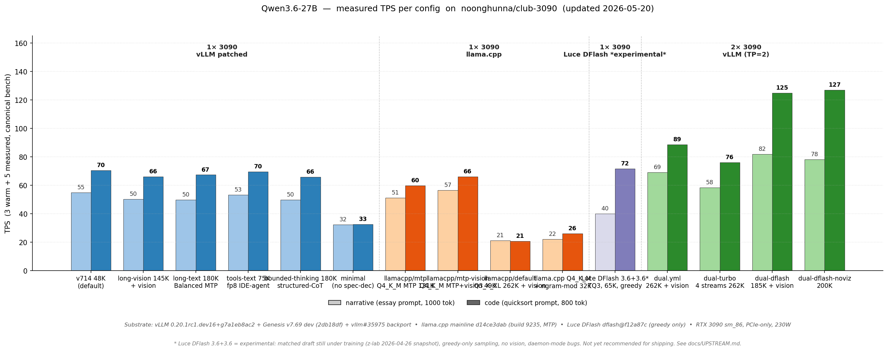

# club-3090

**Recipes for serving LLMs locally on RTX 3090s.** Multi-engine (vLLM, llama.cpp, SGLang), multi-model, model-agnostic by design.

If you have one or two RTX 3090s and want to run modern LLMs at home, in a homelab, or as a dev backend — this repo collects the working configs, patches, and benchmarks.

---

## TL;DR — what this is

- **Two complementary routes** — pick by what your workload breaks on:
  - 🏎 **vLLM dual** = max throughput. Up to **127 TPS code** (DFlash) or **4 concurrent streams @ 262K** (turbo). Full feature stack (vision · tools · MTP · streaming).
  - 🛡 **llama.cpp single** = max robustness. Full **262K context** on one 3090. Stress-tested clean: no prefill cliffs, 25K-token tool returns work, 90K needle ladder passes. Slower (~21 TPS) but doesn't crash on real-world tool-using agents.
- **Validated docker compose configs** for both routes — drop-in OpenAI-compatible API on `localhost:8020`
- **Multi-engine**: vLLM (full features), llama.cpp (max ctx + robustness), SGLang (currently blocked, watch list)
- **Model-agnostic**: today ships configs for Qwen3.6-27B; structure scales as we add models

**First time here?** → [Models](#supported-models) — pick yours.
**Already running, want to compare engines?** → [docs/engines/](docs/engines/)
**Picking an engine** (vLLM / llama.cpp / SGLang / ktransformers / ik_llama.cpp)? → [docs/INFERENCE_ENGINES.md](docs/INFERENCE_ENGINES.md)
**Hardware questions** (does this work on a 4090, do I need NVLink)? → [docs/HARDWARE.md](docs/HARDWARE.md)
**Don't know what TPS / KV / MTP mean?** → [docs/GLOSSARY.md](docs/GLOSSARY.md)

> ⚠️ **Known issue (2026-05-05)**: Single-card 24 GB long-context (>~50K tokens) on `long-text.yml` / `long-text-no-mtp.yml` / `long-vision.yml` can OOM despite Genesis v7.72.2's PN59 fix. PN59's runtime eligibility check rejects the chunked-prefill path that 24 GB single-card configs are forced to take. Filed at [Sandermage/genesis-vllm-patches#22](https://github.com/Sandermage/genesis-vllm-patches/issues/22), pending Sander review. **If you hit it**: switch to `dual.yml` / `dual-turbo.yml` (TP=2 escapes the cliff) or `llamacpp/default` (different engine, no Cliff 2). See [docs/CLIFFS.md](docs/CLIFFS.md) for the full diagnosis.

---

## Pick your path

| You have | Start here |
|---|---|
| **1× RTX 3090** | [`docs/SINGLE_CARD.md`](docs/SINGLE_CARD.md) — workload → config → quick start |
| **2× RTX 3090** (PCIe / no NVLink) | [`docs/DUAL_CARD.md`](docs/DUAL_CARD.md) — workload → config → quick start |
| **3+ GPUs** (any class — 4× 3090, 8× A6000, mixed) | [`docs/MULTI_CARD.md`](docs/MULTI_CARD.md) — TP scaling math, derivation from `dual.yml`, valid TP values |
| Considering self-host vs cloud APIs | [`docs/COMPARISONS.md`](docs/COMPARISONS.md) — cost crossover + when each wins |

Each hardware page lists every supported model with the working composes for that card count, plus measured TPS and per-workload pitfalls. Model-specific deep dives (quants, Genesis patches, engine internals) live under [`models/<name>/`](models/).

---

## Supported models

| Model | Status | Card counts | Engines | Highlights |
|---|---|---|---|---|
| **[Qwen3.6-27B](models/qwen3.6-27b/)** | Production-ready ⭐ | 1× / 2× 3090 | vLLM ✅ · llama.cpp ✅ · SGLang ❌ blocked | Vision · tools · MTP n=3 · up to 262K ctx · vLLM dual = 89/127 TPS · llama.cpp single = full 262K, no prefill cliffs |
| **[Gemma 4 31B](models/gemma-4-31b/)** | Production-ready (dual-card only on Ampere 24 GB) | 2× 3090 only ¹ | vLLM ✅ · llama.cpp ❌ · SGLang ❌ | Vision · tools · MTP n=3 (Google official drafter) **OR** DFlash n=7 (z-lab drafter) · up to 262K ctx via INT8 PTH KV (PR [#40391](https://github.com/vllm-project/vllm/pull/40391) vendored) · MTP dual = 106/141 TPS at 32K, 95/126 at 262K · DFlash dual = 105/177 TPS at 32K (code-optimal) |

¹ Single-card boot OOMs on Ampere 24 GB regardless of KV format (weights + drafter + profiling at 8K ctx leaves no KV pool). Single-card Gemma 4 is feasible on 32 GB+ GPUs (validated on RTX 5090 32 GB by [@apnar](https://github.com/noonghunna/club-3090/discussions/67#discussioncomment-16832042)).

More models coming. The repo structure scales — when we add Qwen3.5-27B / GLM-4.6 / etc., they go under `models/<name>/` with the same internal pattern.

---

## Measured TPS at a glance



Bench protocol: 3 warm + 5 measured runs of the canonical narrative + code prompts. Substrate: vLLM nightly `0.20.1rc1.dev16+g7a1eb8ac2` + Genesis v7.69 dev tip (commit `2db18df`), with local backports `patch_inputs_embeds_optional.py` (vllm#35975) and `patch_tolist_cudagraph.py`. llama.cpp mainline `0d0764dfd`, RTX 3090 sm_86 PCIe-only at 230 W. Per-config details + run-by-run numbers + VRAM + AL/accept rates: [models/qwen3.6-27b/CHANGELOG.md](models/qwen3.6-27b/CHANGELOG.md) (per-model history) and [scripts/bench.sh](scripts/bench.sh) (canonical bench).

---

## Quick start (for the current model — Qwen3.6-27B on vLLM)

```bash
# 1. Clone the repo
git clone https://github.com/noonghunna/club-3090.git
cd club-3090

# 2. Pick/download + SHA-verify the model (interactive hardware-aware picker)
#    (asks you which model, then where to put model weights — pick in-repo
#     default, ~/models, or a custom path on a different drive. To skip prompts:
#     `export MODEL_DIR=/mnt/your-drive/models` and pass the model name. See FAQ.)
bash scripts/setup.sh
#    Or scripted:
#      bash scripts/setup.sh qwen3.6-27b

# 3. Pick a config + boot it (interactive hardware-aware wizard — asks cards / workload)
bash scripts/launch.sh
#    Or skip the wizard:
#      bash scripts/launch.sh --variant vllm/default      # single-card chat (recommended)
#      bash scripts/launch.sh --variant vllm/dual         # dual-card 262K + vision
#      bash scripts/launch.sh --variant llamacpp/default  # single-card 262K, no cliffs
#    See all variants:
#      bash scripts/switch.sh --list

# 4. Sanity test (launcher already printed this curl)
curl -sf http://localhost:8020/v1/chat/completions \
  -H "Content-Type: application/json" \
  -d '{"model":"qwen3.6-27b-autoround","messages":[{"role":"user","content":"Capital of France?"}],"max_tokens":200}'

# 5. Run the canonical benchmark
bash scripts/bench.sh

# 6. Switch later without re-clicking through the wizard:
bash scripts/switch.sh vllm/long-vision   # for example

# 7. Keep your install up-to-date as the stack moves (Genesis pin bumps,
#    new compose variants, vendored patch updates):
bash scripts/update.sh
#   - bails if your tree has uncommitted edits (commit or stash first)
#   - git pull --ff-only origin master, then re-runs setup.sh
#   - tells you to restart your container via switch.sh after — so you can
#     A/B old-vs-new before bringing the new variant up
#   launch.sh + switch.sh also soft-warn at boot when your checkout is
#   behind origin/master, so you'll usually find out before you ask.
```

`launch.sh` calls `switch.sh` (down old, up new) and then `verify-full.sh` so you know it's serving cleanly before you point a client at it. See [`scripts/`](scripts/) for all helpers.

For client snippets — Python (`openai` SDK + raw `requests`), TypeScript / Node, plus connection settings for Open WebUI, Cline, Cursor, and other OpenAI-compat clients — see [`docs/EXAMPLES.md`](docs/EXAMPLES.md). Common questions ("can I use a 4090?", "why MTP not EAGLE?", "why not Ollama?", "what's a prefill cliff?") have answers in [`docs/FAQ.md`](docs/FAQ.md). Trying to decide self-host vs cloud APIs vs other local options? [`docs/COMPARISONS.md`](docs/COMPARISONS.md). Want to contribute numbers, bug repros, or new variants? [`CONTRIBUTING.md`](CONTRIBUTING.md). Tracking the upstream issues and PRs we depend on or have filed? [`docs/UPSTREAM.md`](docs/UPSTREAM.md).

**Hit an issue or want to share bench numbers?** Run `bash scripts/report.sh > my-rig.md` (add `--full` for the canonical "everything" pass: rig + verify-full + verify-stress 7/7 + SOAK_MODE=continuous + bench, ~35 min) and paste into the [bug](https://github.com/noonghunna/club-3090/issues/new?template=bug-report.yml) or [bench](https://github.com/noonghunna/club-3090/issues/new?template=numbers-from-your-rig.yml) issue template — single command captures everything we'd otherwise ask for individually. **Not on our shipped Docker composes?** Scripts now work on non-Docker host builds (llama.cpp host server, SGLang, etc.) via `URL=... CONTAINER=none MODEL=... bash scripts/...` — see [discussion #88](https://github.com/noonghunna/club-3090/discussions/88) for the full contributor flow.

For llama.cpp (different engine, different recipe — useful for max context on single-card):
```bash
cd models/qwen3.6-27b/llama-cpp && cat README.md
```

---

## Repo layout

```
club-3090/
├── README.md                              this file — start here
├── CHANGELOG.md                           cross-cutting changes (engine pin bumps, script updates)
├── LICENSE                                Apache-2.0
├── docs/
│   ├── ARCHITECTURE.md                    how this stack thinks about LLM serving on 24 GB
│   ├── HARDWARE.md                        Ampere SM 8.6+, NVLink note, 24 GB ceilings
│   ├── GLOSSARY.md                        plain-language definitions (TPS / KV / MTP / TP / etc.)
│   ├── UPSTREAM.md                        every upstream issue / PR we depend on or have filed
│   ├── CLIFFS.md                          full synopsis of the prefill cliffs (root causes + fix landscape)
│   ├── img/                               chart sources (performance.svg, vram-budget-{single,dual,combined}.svg) + PNG exports
│   └── engines/                           cross-model engine comparison + per-engine deep dives
│       ├── README.md                      decision tree, pros/cons matrix
│       ├── VLLM.md                        vLLM general docs + tuning
│       ├── LLAMA_CPP.md                   llama.cpp general docs + 262K recipe
│       └── SGLANG.md                      blocked status + watch list
├── models/
│   └── qwen3.6-27b/                       all Qwen3.6-27B-specific stuff
│       ├── README.md                      model overview + variants + recommendations
│       ├── INTERNALS.md                   model-specific bugs (DeltaNet cliffs, Genesis patches, MTP head, Marlin pad)
│       └── INTERNALS.md                   engineering rationale (Genesis, Marlin pad, DFlash)
│       ├── CHANGELOG.md                   model-specific dated history
│       ├── vllm/
│       │   ├── README.md                  "vLLM recipes for Qwen3.6-27B"
│       │   ├── compose/                   docker-compose files (single-card + dual-card variants)
│       │   └── patches/                   tolist_cudagraph + Marlin pad README + Genesis pointer
│       ├── llama-cpp/
│       │   ├── README.md                  "llama.cpp recipes for Qwen3.6-27B"
│       │   └── recipes/                   single-card 65K + 262K-max-ctx + dual-card recipes
│       └── sglang/
│           └── README.md                  blocked status — what would unblock it on this model
├── scripts/                               shared, model-aware
│   ├── setup.sh                           bash setup.sh <model> → preflight + downloads + verifies + Genesis
│   ├── launch.sh                          interactive wizard: cards → workload → boots compose + verifies
│   ├── switch.sh                          stateless variant switcher (bring down old, up new)
│   ├── update.sh                          one-shot upgrade: git pull + re-pin Genesis + re-vendor patches
│   ├── health.sh                          runtime health probe (KV %, MTP AL, recent TPS, errors)
│   ├── preflight.sh                       sourceable lib: docker / GPU / disk / repo-drift / Genesis-pin checks
│   ├── verify.sh                          quick smoke test (engine-aware via env)
│   ├── verify-full.sh                     fast functional test (8 checks, ~1-2 min)
│   ├── verify-stress.sh                   boundary-case stress test (longctx ladder + tool prefill OOM, ~5-10 min)
│   ├── soak-test.sh                       runtime VRAM accretion / multi-turn agent traffic (~10-30 min, opt-in)
│   ├── bench.sh                           canonical TPS bench
│   └── report.sh                          paste-ready triage report (run before filing a bug or sharing bench numbers)
└── tools/
    └── charts/                            re-generate docs/img/* SVGs and PNG exports (matplotlib)
        ├── gen-perf.py                    perf bar charts (combined + single + dual)
        └── gen-vram.py                    VRAM stacked bars (combined + single + dual)
```

---

## What you'll need

| For any model on this stack | Notes |
|---|---|
| 1× or 2× NVIDIA RTX 3090 (24 GB each) | Larger Ampere/Ada cards (4090, A6000) work; smaller cards (12 GB) don't fit 27B-class models. |
| Linux (Ubuntu 22.04+ tested) | macOS/Windows: vLLM is Linux + CUDA only. Llama.cpp works on macOS/Windows but recipes assume Linux paths. |
| Docker + NVIDIA Container Toolkit | For vLLM. llama.cpp works without Docker. |
| NVIDIA driver 580.x+ | For CUDA 13 runtime in vLLM nightly. |
| ~30 GB free disk | Per model. More for multiple models. |

See [docs/HARDWARE.md](docs/HARDWARE.md) for hardware-specific notes (PCIe vs NVLink, power draw, etc.).

---

## How this is structured

**Engines and hardware are general** — the docs in `docs/` apply across models. vLLM works the same way regardless of whether you're serving Qwen, GLM, or Llama; the engine docs cover that once.

**Models are specific** — under `models/<name>/`, you find that model's quants, quirks, recommended configs, and engine-specific recipes. Adding a new model means adding a new subdir with the same internal pattern.

**Scripts are shared but model-aware** — `bash scripts/setup.sh qwen3.6-27b` downloads the right model + clones the right patches. When we add another model, you'd run `bash scripts/setup.sh glm-4.6` and the same script handles it.

This separation keeps the stack maintainable as it grows. We don't want a model-specific README at the top; we want the top to be "stack docs" and the model details under their dedicated subdirs.

---

## Community

- 💬 **[Discord](https://discord.gg/3t6UKFGhKw)** — casual chat, hardware questions, share what you're running. Use for synchronous Q&A.
- 📋 **[GitHub Discussions](https://github.com/noonghunna/club-3090/discussions)** — async, searchable. Best for cross-rig benchmark drops, "should I tune X" type threads, and anything you want others to find via search.
- 🐛 **[GitHub Issues](https://github.com/noonghunna/club-3090/issues)** — bug reports, regression repros, concrete asks. Triage ladder in [FAQ](docs/FAQ.md#before-symptom-matching--boot-the-simplest-stack-first) before filing.

## Community projects

Projects in the club-3090 ecosystem maintained outside this repo:

- **[VykosX/club-3090-server](https://github.com/VykosX/club-3090-server)** — single-file installer adding a server-management layer on top of club-3090: browser admin panel on `:8008/admin`, OpenAI-compatible reverse proxy on `:8009` with multi-backend routing, GPU-aware multi-instance orchestration, fan/power controls, audit logs, and per-user API auth/quota. Headless Arch + Debian/Ubuntu friendly. Started 2026-05-05, AGPL-3.0; see [discussion #108](https://github.com/noonghunna/club-3090/discussions/108) for the announcement and current WIP status. **Not yet officially adopted** — listed here as a community pointer until it converges on a stable surface area.

If you've built something that integrates with club-3090 and you'd like a pointer added here, open a discussion.

---

## Migration history

- **2026-04-28** — Repo created. Consolidates and supersedes:
  - [`noonghunna/qwen36-27b-single-3090`](https://github.com/noonghunna/qwen36-27b-single-3090) (single-card recipe; archived for issue history)
  - [`noonghunna/qwen36-dual-3090`](https://github.com/noonghunna/qwen36-dual-3090) (dual-card recipe; archived for issue history)

  Old repos remain readable for existing issue threads, external links (Medium articles, Reddit posts), and historical context. New issues should be filed here.

See [CHANGELOG.md](CHANGELOG.md) for the merged dated history.

---

## Credits

The stack stands on a lot of shoulders:

- **Qwen team** ([@Alibaba_Qwen](https://huggingface.co/Qwen)) — for the base models and the MTP head architecture
- **[Lorbus](https://huggingface.co/Lorbus/Qwen3.6-27B-int4-AutoRound)** — for the AutoRound INT4 quant with preserved BF16 `mtp.fc` (the model this whole stack runs on)
- **[Sandermage](https://github.com/Sandermage/genesis-vllm-patches)** — Genesis patch tree for TurboQuant + hybrid models on consumer Ampere; root-causing #40880 and shipping the v7.14 fix
- **[vibhavagarwal5](https://github.com/vllm-project/vllm/pull/38479)** — TurboQuant landing PR + tracking issue #40069
- **[vLLM project](https://github.com/vllm-project/vllm)** — the engine + active maintenance
- **[llama.cpp](https://github.com/ggerganov/llama.cpp)** — the alternative engine path
- **[Luce z-lab](https://github.com/luce-spec)** — DFlash N=5 draft model for Qwen3.6-27B
- **Intel AutoRound** — quantization framework
- **All cross-rig contributors** — [@ampersandru](https://github.com/ampersandru), [@walmis](https://github.com/walmis), [@3dluvr](https://github.com/3dluvr), and the Reddit / X local-LLM community for benchmark data and bug reports.

---

## License

Apache 2.0. Do what you want with it. If you get better numbers on your rig — open an issue. If you add a new model with working configs — open a PR.
