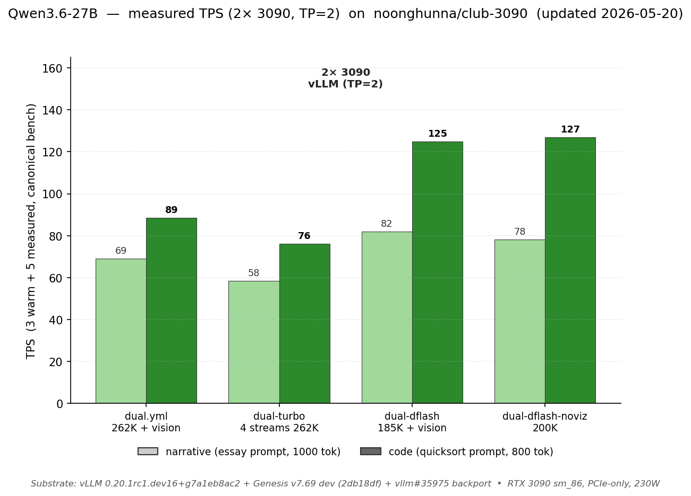

# Dual 3090 — what changes when you add the second card

You have **2× RTX 3090s**. This page is the front door for picking a config and knowing what dual-card unlocks vs single. Model-specific deep dives (quants, Genesis, engine internals) live in the model directory — links at the bottom.

> **Model not in the configs below / want any HF safetensors repo?** → [`docs/PULL.md`](PULL.md): `scripts/pull.sh` evaluates any model against the KV math (honest, no download) and boots it if it passes. The curated configs on this page are the measured path; both work.

**NVLink auto-detection** (since 2026-05-14): the dual-card composes now auto-detect whether an NVLink bridge is present. If you have one, you get the NVLink-optimized path automatically. If not, PCIe mode is used. Override with `NVLINK_MODE=force_on|force_off` in your `.env`. See the "NVLink auto-detection" section below.

> **Have 3+ GPUs?** See [`MULTI_CARD.md`](MULTI_CARD.md) — derivation of TP=4 / TP=8 configs from `dual.yml`, valid TP values for Qwen3.6-27B (1, 2, 4, 5, 8, 10), and what scales vs what doesn't.

---

## TL;DR — pick by workload

### Qwen3.6-27B (default model, also runs single-card)

| What you're doing | Compose | Max ctx | Narr / Code TPS | VRAM per card | Why |
|---|---|---|---|---|---|
| **Hermes agentic fine-tune** (Carnice tool specialization) | [`carnice-bf16mtp.yml`](../models/qwen3.6-27b/vllm/compose/dual/carnice-bf16mtp/bf16-mtp.yml) | **262K** | **72 / 80** | ~22.3 / 24 GB | BF16 MTP overlay. Hermes-style assistant. Available on HF: [wasifb/Carnice_V2_27B_INT4_BF16MTP](https://huggingface.co/wasifb/Carnice_V2_27B_INT4_BF16MTP) |
| General-purpose default (vision + tools + long ctx) | [`dual.yml`](../models/qwen3.6-27b/vllm/compose/dual/autoround-int4/fp8-mtp.yml) ⭐ | **262K** (237K single-prompt verified) | **69 / 89** | ~23.6 / 24 GB | fp8 KV, 2 streams, full feature set |
| Multi-tenant (4 concurrent agents at full ctx) | [`dual-turbo.yml`](../models/qwen3.6-27b/vllm/compose/dual/autoround-int4/turbo.yml) | **262K** | **58 / 76** per-stream (269 TPS aggregate at 4 streams) | ~19.8 / 24 GB | TQ3 KV (3 bits/token) + full v7.69 PROD env-var stack — 4.67× concurrency. **20 GB Ampere users:** override `--kv-cache-dtype turboquant_3bit_nc` → `fp8_e5m2`; see [HARDWARE.md](HARDWARE.md#note-for-sub-24-gb-cards) + [#47](https://github.com/noonghunna/club-3090/issues/47). |
| Peak code TPS with vision | [`dual-dflash.yml`](../models/qwen3.6-27b/vllm/compose/dual/autoround-int4/dflash.yml) | **185K** | **82 / 125** | ~23.6 / 24 GB | DFlash N=5 + 1.75 GB draft per card, AL ~4.4 (vs MTP's 3.4) |
| Peak code TPS, no vision | [`dual-dflash-noviz.yml`](../models/qwen3.6-27b/vllm/compose/dual/autoround-int4/dflash-noviz.yml) | **200K** | **78 / 127** | ~23.8 / 24 GB | DFlash + no vision, +15K ctx vs dual-dflash |

### Gemma 4 31B (dual-card only on Ampere 24 GB ¹)

| What you're doing | Compose | Max ctx | Narr / Code TPS | VRAM per card | Why |
|---|---|---|---|---|---|
| General-purpose default (vision + tools + 32K ctx) | [`dual.yml`](../models/gemma-4-31b/vllm/compose/dual/autoround-int4/bf16-mtp.yml) ⭐ | 32K | **106 / 141** | ~22 / 24 GB | bf16 KV, MTP n=3 (Google's official `gemma-4-31B-it-assistant` drafter). PR [#41745](https://github.com/vllm-project/vllm/pull/41745) merged upstream. |
| Long-context default (262K ctx, balanced TPS) | [`dual-int8.yml`](../models/gemma-4-31b/vllm/compose/dual/autoround-int4/int8.yml) | **262K** | **95 / 126** | ~22.1 / 24 GB | INT8 PTH KV via vendored PR [#40391](https://github.com/vllm-project/vllm/pull/40391) overlay. **8.2× context lift** for ~10% TPS cost. NIAH PASS at 137K. |
| Multi-stream long-context (3.6× concurrency at 98K) | [`dual-int8.yml`](../models/gemma-4-31b/vllm/compose/dual/autoround-int4/int8.yml) (override `MAX_NUM_SEQS=4`) | 98K | **96 / 127** per-stream | ~22.2 / 24 GB | INT8 PTH KV pool 354K tokens → 3.6× concurrency. |
| Peak code TPS with vision | [`dual-dflash.yml`](../models/gemma-4-31b/vllm/compose/dual/autoround-int4/dflash.yml) | 32K | **105 / 177** | ~22.3 / 24 GB | z-lab Gemma 4 DFlash drafter, n=7. **+18% code TPS over MTP** (177 vs 141). bf16 KV. |

¹ Single-card boot OOMs on Ampere 24 GB regardless of KV format. Single-card Gemma 4 is feasible on 32 GB+ GPUs (validated on RTX 5090 32 GB by [@apnar](https://github.com/noonghunna/club-3090/discussions/67#discussioncomment-16832042) — 160/215 TPS at 32K MTP, 150/261 at 12K DFlash). Tracked in [`docs/UPSTREAM.md`](UPSTREAM.md) row 78 + [#67](https://github.com/noonghunna/club-3090/discussions/67).

> **VRAM column is per-card** under TP=2 (each card holds half the weights + half the KV; both cards' totals are nearly identical). For a 2× 20 GB rig (e.g. 2× 3080-20GB / 40 GB combined), `dual.yml` and `dual-turbo` should fit; `dual-dflash*` won't (FP16 KV + DFlash draft pushes per-card past 20 GB). Component breakdown in [`tools/charts/gen-vram.py`](../tools/charts/gen-vram.py).

Run any of these via `bash scripts/launch.sh` (interactive) or `bash scripts/switch.sh <variant>`.

---

## Measured TPS on 2× 3090



Bench protocol: 3 warm + 5 measured runs of the canonical narrative + code prompts on each config. Substrate: vLLM nightly `0.20.1rc1.dev16+g7a1eb8ac2` + Genesis v7.69 dev tip (commit `2db18df`), RTX 3090 sm_86 PCIe-only at 230 W. Cliff 2 doesn't apply on TP=2 (DeltaNet GDN forward state splits across cards — 237K single-prompt verified on `dual.yml`); the v7.69 cutover is mostly a hygiene bump for `dual-turbo.yml` (its old workspace_lock sidecar is now covered by Genesis PN34 env-gate). Per-config run-by-run + VRAM peaks: [models/qwen3.6-27b/CHANGELOG.md](../models/qwen3.6-27b/CHANGELOG.md).

---

## VRAM budget on 2× 24 GB (TP=2)


**Tensor parallelism (TP=2) splits weights AND KV symmetrically across both cards.** Each card holds ~7 GB of weights (vs ~14 GB on single-card) plus its half of the KV pool. That's why dual unlocks what single can't:

- 262K context + vision + 2 streams fits at ~23.6 GB / card on `dual.yml` (would need ~33 GB on a hypothetical single-card)
- DFlash draft adds ~1.75 GB / card (manageable across two cards; would crowd out KV on single)
- 4 concurrent streams via `dual-turbo` use TQ3 KV's compactness to fit 4 × full-context KV pools

For the single-card picture, see [`SINGLE_CARD.md`](SINGLE_CARD.md).

---

## Pick a config

### General default — `dual.yml`

**Workload:** anything. Chat, tool agents, vision, mixed-modal. The recommended default for 2× 3090.

262K context, fp8 KV, MTP n=3, 2 streams, vision tower active. **Genesis-less by design** — fp8 KV doesn't trigger the cudagraph bug (#40880) that drove Genesis's existence on single-card. Pure vLLM nightly path. Tool calls work via `--tool-call-parser qwen3_coder` + `--enable-auto-tool-choice`. All `verify-stress.sh` checks pass clean.

**When to pick:** the obvious starting point. Unless one of the specialized variants below names your exact workload, this is right. **Strongly recommended for IDE coding agents** (Cline / OpenCode / Roo / Claude Code / Cursor) — fp8 KV avoids the inductor compile-path leak that affects all 4 TQ3-KV variants. See [club-3090#16](https://github.com/noonghunna/club-3090/issues/16).

### Multi-tenant — `dual-turbo.yml`

**Workload:** small team or agent farm running 2-4 concurrent sessions. Open WebUI multi-user, GitHub-Actions-with-AI-PRs flows, batch agent runs.

262K + **TurboQuant 3-bit KV** + Genesis v7.69 PROD env-var stack + 4 streams. TQ3 packs each KV slot to ~3 bits/token (vs fp8's ~8 bits), which is what makes 4 × 262K pools fit on 2 cards. KV pool 1.52M tokens, max concurrency **4.67×**. Per-stream TPS lands at **58 narr / 76 code** (n=5, CV 3-5%), AL 3.39-3.51, MTP avg accept 79-84%, VRAM 19.8 GB / card.

**Concurrent throughput** (n=4 streams of the canonical code prompt, 2026-05-01 PM, vLLM v0.20 + Genesis v7.65 dev tip — re-bench against v7.69 pending but decode TPS regime unchanged by the bump): aggregate code TPS 269 across 4 streams (3.63× speedup over single-stream 74 TPS), per-stream mean 74 (CV 3.1%) — true parallel decoding, not interleaved. See `results/v0.20-migration/dual-turbo-concurrent.summary` for the run-by-run.

> ⚠️ **Decode-concurrent ≠ long-prefill-overlap** (see [#208](https://github.com/noonghunna/club-3090/discussions/208)). The 269-TPS figure above is *decode-concurrent* — N short-prompt streams decoding together. A **different** regime, a **long prefill** (big tool result, file read, accumulated context) entering while another stream is *already decoding*, can **starve decode** to ~0.1–0.9 TPS until the prefill clears: chunked-prefill co-batches the heavy GDN/Mamba prefill chunk with the decode token into one forward step, and the `align` block floors the chunk at **1568 tokens** so it can't be tuned to zero. Observed on `dual.yml` (fp8); it's architectural to the hybrid model, so expect it on any dual-card chunked-prefill config. **So read 269 TPS as aggregate *throughput*, not a *latency* guarantee under agentic traffic.** Mitigations: lower `--max-num-batched-tokens` toward the 1568 floor to soften it (doesn't eliminate it); **proxy-level admission control** — gate large prefills away from live interactive decodes — is the real fix (`--scheduling-policy priority` does *not* help: it orders admission, not intra-step compute). Per-budget latency numbers pending a community A/B.

**When to pick:** real concurrent load. Solo users won't see the win on the per-stream curve — but per-stream TPS at n=4 is essentially the same as n=1 here (74 vs 76 TPS code), so this is also a viable single-stream config if you want max KV pool. Pick this if you ever serve >1 request at a time, or want the biggest single-card-equivalent context.

### Peak code TPS, with vision — `dual-dflash.yml`

**Workload:** code-heavy single-stream — fast iteration on quicksort-class problems, Cline going through a codebase, Cursor doing inline completions in a heavy file.

185K context (vs 262K — DFlash's draft model takes ~1.75 GB / card), FP16 KV (forced — DFlash's non-causal head_size=256 path requires fp16), DFlash N=5 draft model from Luce z-lab. **Code TPS lands at 125** vs `dual.yml`'s 89 — a real 40% jump on code prompts thanks to DFlash's higher acceptance length (AL ~4.4 vs MTP's 3.4).

**When to pick:** code is the dominant workload, you want TPS over context budget, vision is still required.

**⚠️ Prereq before this compose works:** download the DFlash draft model:
```bash
WITH_DFLASH_DRAFT=1 bash scripts/setup.sh qwen3.6-27b
# OR manually:
hf download z-lab/Qwen3.6-27B-DFlash --local-dir <MODEL_DIR>/qwen3.6-27b-dflash
```
Without it, vLLM falls back silently to baseline bf16 decode (~25 TPS, not 125). Reported by [@lolren in #18](https://github.com/noonghunna/club-3090/discussions/18#discussioncomment-16787831).

**Caveats:**
- DFlash's per-position acceptance falls off faster than MTP — narrative TPS (82) is good but not dramatically better than `dual.yml`'s 69. The win is concentrated on code/repetitive prompts.
- The z-lab draft is **still under training** (see [UPSTREAM.md](UPSTREAM.md#luce-dflash-luce-orglucebox-hub--separate-llamacpp-fork-not-our-vllm-dual-dflash)). Published 125 TPS code is against the 2026-04-26 snapshot at peak code-prompt conditions; agent traffic with mixed code + narrative + tool schemas will see lower per-stream TPS until z-lab tags training-complete. **For autonomous coding agents (Cline / OpenCode / Pi / Claude Code) prefer `dual.yml` (FP8 + MTP) until then** — its 89 code TPS is robust across prompt shapes.

### Peak code TPS, no vision — `dual-dflash-noviz.yml`

**Workload:** same as above, but no images. Squeezes another 15K of context out of the vision-tower's space.

200K context, FP16 KV, DFlash N=5, `--language-model-only`. Best code TPS in the lineup at **127**. Narrative is 78 (slight drop vs vision variant from compute distribution).

**When to pick:** pure-text code work where you'd rather have 200K than 185K. Drop vision wherever you don't need it.

---

## What dual-card unlocks (vs single)

| Want | Single-card status | Dual-card status |
|---|---|---|
| 262K context + vision | Works on `long-vision.yml` (192K) but Cliff 1 fires on big tool prefills | `dual.yml` — clean, 262K, no Cliff 1 |
| 4 concurrent streams at full context | Single-card serializes; can't fit | `dual-turbo.yml` — 4 streams, 262K each |
| DFlash N=5 spec-decode | Blocked: DFlash needs head_size=256 + non-causal which doesn't fit single-card head-dim split | `dual-dflash.yml` / `dual-dflash-noviz.yml` |
| Code TPS >100 | Best single-card is 67 code (default) | 125-127 code (DFlash variants) |
| Long single prompts safely | Cliff 2 fires at 50-60K on vLLM single-card (forces llama.cpp fallback at 21 TPS) | TP=2 splits activation across cards — **237K single-prompt verified** on `dual.yml` 2026-04-29 (~830 tok/s prefill, no OOM, peak 23.5 GB / card) |
| Big tool returns at 192K context | Cliff 1 fires on TQ3 paths regardless | `dual.yml` is below the cliff at 262K — activation budget is bigger per-card after split |

---

## Common pitfalls (dual-card specifics)

### Marlin pad-sub-tile-n mount dependency

The dual variants currently mount `/opt/ai/engines/vllm/primary/vllm/model_executor/kernels/linear/mixed_precision/marlin.py` (and one neighbor) read-only into the container. This is our patched fork of [vllm#40361](https://github.com/vllm-project/vllm/pull/40361) — required for AutoRound W4A16 at TP=2 where output-dim shards fall below 64. **You need to clone vLLM source to `/opt/ai/engines/vllm/primary/`** for these composes to boot. When the upstream PR lands, we'll drop the mount.

If you don't have `/opt/ai/engines/vllm/primary/`:

```bash
sudo mkdir -p /opt/ai && sudo chown $USER /opt/ai
git clone https://github.com/vllm-project/vllm.git /opt/ai/engines/vllm/primary
cd /opt/ai/engines/vllm/primary && git checkout main
```

### NVLink auto-detection

The dual-card composes automatically detect whether an NVLink bridge is installed and configure themselves accordingly. No separate compose files needed — `dual.yml`, `dual-turbo.yml`, `dual-dflash.yml`, and `dual-dflash-noviz.yml` all adapt to your hardware.

**How it works:** Each dual compose mounts `scripts/detect_nvlink.sh` and sources it in the entrypoint at container boot. The script checks `nvidia-smi topo -m` for NVLink links between GPUs, sets the correct NCCL env vars, and the entrypoint conditionally passes `--disable-custom-all-reduce` to vLLM.

**Override:** Set `NVLINK_MODE` in your `.env` (passed through to the container):
- `auto` (default) — detect via `nvidia-smi topo -m`
- `force_on` — assume NVLink bridge present, enable NVLink mode
- `force_off` — force PCIe-only path even if NVLink detected

Without NVLink, `--disable-custom-all-reduce` is passed to vLLM and `NCCL_P2P_DISABLE=1` is set. With NVLink, custom all-reduce is enabled and NCCL uses the NVLink path. The per-stream TPS difference is ~10-15% on dual 3090 (see cross-rig data in [BENCHMARKS.md](../BENCHMARKS.md)).

### `dual.yml` is Genesis-less by design

The single-card cliffs (Cliff 1 / Cliff 2) and the cudagraph bug (#40880) that drove Genesis's existence don't fire on `dual.yml` — fp8 KV + 2 streams + 262K has plenty of headroom. So `dual.yml` runs **plain vLLM nightly** without any patch tree. If you want Genesis on dual (e.g. for `dual-turbo`'s TQ3 spec-verify path), it's structurally enabled there but absent from `dual.yml`.

### DFlash variants are FP16 KV (forced)

DFlash's `combine_hidden_states` path needs `head_size=256` + non-causal, which forces FP16 KV on Ampere — there's no fp8 / TurboQuant alternative for this path right now. Tracked at [vllm#40334](https://github.com/vllm-project/vllm/pull/40334). When that lands you can drop `--dtype bfloat16` and let dtype auto-detect.

### DFlash's vision compatibility

The DFlash draft + ViT path is documented and works (`--language-model-only` was historically required, now optional). `dual-dflash.yml` keeps vision; `dual-dflash-noviz.yml` drops it for an extra 15K ctx.

### Single-stream user on dual = small win

If you're solo-using on dual, you're paying for hardware that mostly sits idle on alternate GPUs during single-stream decode. The win shows up at concurrency or when you need DFlash. For solo users, single-card is often the better cost choice.

---

## Quick start

```bash
# 1. Setup (downloads model, clones Genesis + vllm-src, ~20 min cold)
bash scripts/setup.sh qwen3.6-27b
git clone https://github.com/vllm-project/vllm.git /opt/ai/engines/vllm/primary    # required for dual variants

# 2. Pick + boot via wizard (asks model + GPUs, projects VRAM budget, auto-picks TP=2 for matched 2× 3090)
bash scripts/launch.sh

# 3. Or skip the wizard:
bash scripts/launch.sh --variant vllm/dual              # general default
bash scripts/launch.sh --variant vllm/dual-turbo        # 4 streams
bash scripts/launch.sh --variant vllm/dual-dflash       # peak code + vision
bash scripts/launch.sh --variant vllm/dual-dflash-noviz # peak code, no vision

# 4. Sanity test
curl -sf http://localhost:8020/v1/chat/completions \
  -H "Content-Type: application/json" \
  -d '{"model":"qwen3.6-27b-autoround","messages":[{"role":"user","content":"Capital of France?"}],"max_tokens":200}'

# 5. Switch later without re-running setup
bash scripts/switch.sh vllm/dual-dflash    # for example
bash scripts/switch.sh --list              # show all variants
```

---

## Performance summary

For variance, AL / accept rates, per-config row docstrings: see each compose YAML, plus the [TPS chart for the full lineup](../README.md#measured-tps-at-a-glance) in the top-level README.

| Compose | Max ctx | Narr / Code TPS | TTFT | Concurrency | Vision | Best for |
|---|---|---|---|---|---|---|
| `dual.yml` | 262K | 69 / 89 | ~145 ms | 2 | ✅ | general default |
| `dual-turbo.yml` | 262K | 58 / 76 per stream (269 agg @ 4) | ~110 ms | 4 | ✅ | multi-tenant |
| `dual-dflash.yml` | 185K | 82 / 125 | ~140 ms | 1 | ✅ | code + vision |
| `dual-dflash-noviz.yml` | 200K | 78 / 127 | ~145 ms | 1 | ❌ | pure text code |

All four dual variants re-benched 2026-05-01 PM on the v0.20 + Genesis v7.65 dev tip substrate (n=5 measured + 3 warmup per prompt; v7.69 re-bench pending — decode TPS regime unchanged by the bump, which targets Cliff 2 prefill envelope on single-card):

| Variant | Narr / Code wall_TPS (CV) | vs prior chart |
|---|---|---|
| `dual.yml` | 68.61 / 90.71 (CV 1.8% both) | flat (within noise) |
| `dual-turbo.yml` | 58.33 / 76.01 (n=1) · 269 TPS aggregate at n=4 streams | matches prior |
| `dual-dflash.yml` | 77.12 / 125.97 (CV 2-4%) | code flat, narr -5.9% (slight) |
| `dual-dflash-noviz.yml` | 78.94 / 123.18 (CV 2-3%) | flat (within noise) |

Code TPS held within bench variance across all 4 variants — no v0.20 regression on fp8 / FP16 paths. Run-by-run + per-config summaries in [`results/v0.20-migration/`](https://github.com/noonghunna/club-3090/tree/master/results/v0.20-migration).

---

## Models supported on dual 3090

- **[Qwen3.6-27B](../models/qwen3.6-27b/)** — primary model. Runs single-card AND dual-card. Quant choices (AutoRound INT4, GGUF Q3_K_XL / Q4_K_M), Genesis patch surface (mostly single-card relevant), engine internals all in the model directory.
- **[Gemma 4 31B](../models/gemma-4-31b/)** — dual-card only on Ampere 24 GB (single-card boot OOMs even at 8K ctx; needs 32 GB+ per card). Two drafter paths (MTP via Google's official `gemma-4-31B-it-assistant` + DFlash via z-lab) × two KV strategies (bf16 / 32K vs INT8 PTH / 262K) + AWQ-4bit-weights variant. Genesis doesn't apply (Genesis patches are Qwen3-Next-specific).

As more models land, they'll show up here with their dual-card compose set.

---

## Deep dives

### Qwen3.6-27B
- **[Model README](../models/qwen3.6-27b/)** — quant choices (AutoRound INT4 / GGUF), Genesis patch surface (mostly single-card relevant), what's working / what's not.
- **[INTERNALS.md](../models/qwen3.6-27b/INTERNALS.md)** — engineering rationale: AutoRound vs GPTQ, DFlash forensics, Marlin pad fork, MTP, upstream tracker.
- **[VRAM allocation diagram](../models/qwen3.6-27b/README.md#vram-allocation-across-configs)** — full per-config breakdown across single + dual.

### Gemma 4 31B
- **[Model README](../models/gemma-4-31b/)** — quants (BF16 source, AWQ-4bit, INT8 PTH KV via PR #40391 vendored overlay), drafter options (MTP / DFlash), upstream PR tracker.
- **[Discussion #67](https://github.com/noonghunna/club-3090/discussions/67)** — first Ampere consumer cross-rig data thread. MTP, DFlash, INT8 PTH long-context, single-card 5090 numbers.

### Cross-cutting
- **[FAQ.md](FAQ.md)** — common questions (NVLink? AMD/Intel? Why fp8 not TQ3 on dual.yml? etc.).
- **[EXAMPLES.md](EXAMPLES.md)** — Python / TS / curl client snippets + IDE connection settings.
- **[HARDWARE.md](HARDWARE.md)** — Ampere SM 8.6 specifics, NVLink (declined), power caps, PCIe topology.
- **[CLIFFS.md](CLIFFS.md)** — single-card Cliff 1 / Cliff 2 mechanisms (mostly Qwen3-Next-specific; Gemma 4 doesn't have these because it's dense attention without DeltaNet).
- **[UPSTREAM.md](UPSTREAM.md)** — every upstream PR / issue we filed or watch (vLLM, Genesis, lucebox-hub, transformers, llama.cpp, SGLang).
- **[SINGLE_CARD.md](SINGLE_CARD.md)** — when one card is enough (Qwen3.6-27B only — Gemma 4 needs ≥32 GB single-card).
