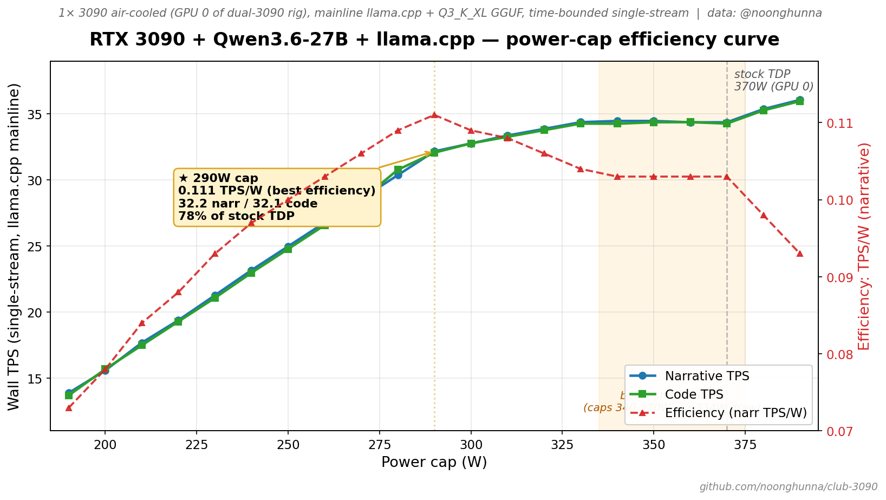
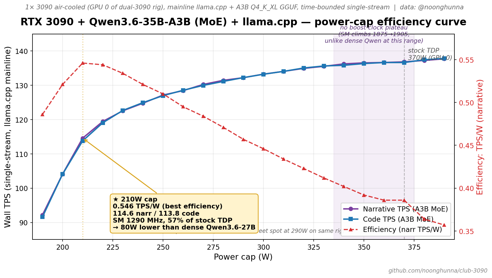
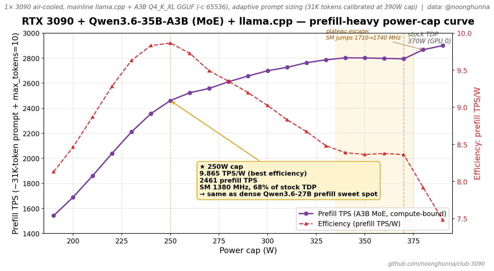

# Hardware notes

What this stack assumes about your hardware. True regardless of which model or engine you're running.

---

## Required

- **NVIDIA RTX 3090 (24 GB, Ampere SM 8.6)** — 1 or 2 cards.
- **PCIe Gen 4 slot** — Gen 3 works but allreduce on dual-card is slower (mild impact on multi-tenant; minimal impact on single-stream).
- **NVIDIA driver 580.x or newer** — for CUDA 13 runtime in vLLM nightly. `nvidia-smi` to check. Older drivers won't load CUDA 13 kernels.
- **Linux** (Ubuntu 22.04+ tested). vLLM is Linux + CUDA only. llama.cpp works on macOS / Windows but our recipes assume Linux paths.
- **Docker + NVIDIA Container Toolkit** for vLLM. llama.cpp doesn't need Docker.

---

## Other Ampere/Ada cards

The recipes are written against 3090 specifically but should work on:

| Card | VRAM | Compute capability | Notes |
|---|---|---|---|
| RTX 3090 | 24 GB | sm_86 | **Tested. Default target.** |
| RTX 3090 Ti | 24 GB | sm_86 | Should work; same VRAM, slightly higher TPS expected |
| **2× RTX 3080 modded 20 GB** | 20 GB / card (40 GB combined) | sm_86 | **Tested 2026-05-02 by [@troymroberts](https://github.com/troymroberts) ([#25](https://github.com/noonghunna/club-3090/discussions/25#discussioncomment-16787782))** at 200W/card power limit. `dual.yml` (TQ k8v4 KV + MTP K=3) boots at full 262K target with `gpu-memory-utilization=0.82` (down from shipped 0.95 — see note below). Available KV pool 5.2 GB/card, max concurrency 1.43×. verify-full 10/10 pass; bench 49 TPS wall single-stream, 210 TPS aggregate at n=8. First published SM86 / 40 GB combined data point outside the 3090 family. |
| RTX 4090 | 24 GB | sm_89 | Should work; ~30% faster decode (newer SMs); same memory characteristics |
| RTX 5090 | 32 GB | sm_120 | Untested; more VRAM relaxes the prefill cliffs but kernel paths might differ |
| RTX A5000 | 24 GB | sm_86 | **Sander's PROD class** for [genesis-vllm-patches](https://github.com/Sandermage/genesis-vllm-patches). Identical SM and VRAM to 3090; should run identically. |
| RTX A6000 | 48 GB | sm_86 | Should work; double VRAM lets you skip the cliff workarounds (use Sandermage's reference defaults) |
| H100 SXM | 80 GB | sm_90 | Different beast; flash-attn 3 paths available; not what these recipes target |

**Won't work:** anything with <20 GB VRAM (3060, 3070, stock 3080, 3080 Ti). The 27B model in INT4 is ~18 GB — KV pool + activations push past 24 GB on smaller cards even with aggressive quantization. **Modded 20 GB 3080s do work** (see row above) — the mod gives them enough headroom for the 27B + TQ K8V4 KV path on TP=2, with `mem-util=0.82` to absorb cudagraph profiling overhead.

### Note for sub-24 GB cards

On 20 GB cards (modded 3080) the cudagraph-profiling overhead is a meaningful slice of available VRAM. Drop `--gpu-memory-utilization` to **0.82** (vs shipped 0.95 for 24 GB). vLLM nightly's `gpu_worker.py` reports the equivalent effective KV size in the boot log; tune to keep activation headroom for the ~15K tool-prefill peak (verify-full check 8). Credit: [@troymroberts](https://github.com/troymroberts).

**4090s with attached display — env-override the compose defaults.** Some 4090 rigs land at ~23.5 GB usable VRAM with X server + driver overhead, vs the headless 3090s the composes are calibrated for. Boot may fail with `No available memory for the cache blocks` at default `max-model-len`. Cross-rig data: @laurimyllari's 4090 single-card on `long-text.yml` needed `MAX_MODEL_LEN=90000` (down from 180K default) to fit cleanly ([disc #62](../../../noonghunna/club-3090/discussions/62) / [issue #71](../../../noonghunna/club-3090/issues/71)). Pattern:

```bash
MAX_MODEL_LEN=90000 bash scripts/switch.sh vllm/long-text
```

Same `MAX_MODEL_LEN` / `GPU_MEMORY_UTILIZATION` env overrides apply for any setup running vLLM alongside other GPU consumers on the same card. See [SINGLE_CARD.md "Running alongside a desktop"](SINGLE_CARD.md#running-alongside-a-desktop--sub-24-gb-usable-vram) for safe ranges.

**`dual-turbo.yml` on 20 GB Ampere — swap TQ3 KV → fp8_e5m2.** The shipped `dual-turbo.yml` uses `--kv-cache-dtype turboquant_3bit_nc` (the technique from [TurboQuant: Online Vector Quantization with Near-optimal Distortion Rate](https://arxiv.org/abs/2504.19874), ICLR 2026 — random rotation + scalar quantizers + 1-bit QJL transform on the residual; the paper claims absolute quality neutrality at 3.5 bits/channel). It's the right pick on 24 GB / 3090: smaller KV pool → more concurrency, and the 24 GB budget absorbs the dequant activation cost during the DeltaNet GDN forward. On 20 GB cards the trade flips: TQ3's activation peak (~1 GB/card more pressure than fp8 during the materialized block — see [PerfMamba arxiv 2511.22849](https://arxiv.org/html/2511.22849) for the underlying Mamba-2 block-state-materialization mechanism the GDN forward inherits) exceeds the per-card budget after TP=2 split, and Cliff 2 fires at 90K. **Override to `--kv-cache-dtype fp8_e5m2`** and you get the full 262K context working with verify-stress 7/7 PASS including 91K needles. Validated 2026-05-04 by [@efschu](https://github.com/noonghunna/club-3090/issues/47) on 2× 3080 modded 20 GB at 0.82 mem-util: bench 82.4 narr / 107.9 code TPS, full 257K-token auto-discovery needle PASS at 90% depth. Trade-off: fp8 KV is roomier per cached token but each token's KV state is larger, so concurrency at full ctx drops vs TQ3. Single-stream long-ctx works cleanly.

---

## NVLink

**Not required.** We've explicitly designed for PCIe-only consumer setups.

- 3090s have an NVLink connector but a **bridge has to be physically installed**. Most consumer setups don't have one. (Cost: ~$70-150 for a working 3-slot bridge if you wanted to add one.)
- Our composes set `NCCL_P2P_DISABLE=1` and avoid NVLink-dependent allreduce paths.
- **If you have NVLink installed and working**, single-stream TPS on dual-card will be ~1.6-1.8× single-card (vs ~1.05× without). Concurrent throughput scales similarly. Not a huge deal unless you really care about per-stream speed.

The user explicitly chose to operate without NVLink. Don't suggest adding one.

---

## Power

Production target: **290W (air-cooled) / 330W (water-cooled) per card** is the sweet spot — peak TPS/W efficiency and only ~5-7% TPS loss vs unrestricted stock.

Power lever:
```bash
sudo nvidia-smi -pm 1            # one-time: enable persistence mode
sudo nvidia-smi -pl 290 -i 0     # air-cooled default (per 21-cap 10W-resolution sweep, this rig)
sudo nvidia-smi -pl 330 -i 0     # water-cooled default (per @syangsao 3-cap data)
sudo nvidia-smi -pl 250 -i 0     # prefill-heavy / RAG workloads — different sweet spot, see below
```

Past the sweet spot: diminishing returns (SM clocks saturate near 1.9 GHz on 3090s); stock TDP is *less* efficient than the sweet-spot cap on Qwen3.6's GDN-attention kernels.

**The "230W is the sweet spot" lore is wrong** — it traces back to early thermal-constrained recommendations and 3-cap-resolution data. Dense 10W sweeps show 230W costs ~16% efficiency vs 290W (decode) and ~4% vs 250W (prefill) on this rig. 230W is a *low-power / quiet* cap, not an efficient one. Use it only if your goal is thermal/acoustic, not perf-per-watt.

**Sweet spot varies by workload class** — same card, same engine, same model:

| Workload | Air-cooled 3090 sweet spot | Notes |
|---|---:|---|
| Decode-single (chat / IDE agent) | **290W** (0.111 TPS/W) | -7% TPS vs 370W stock for -22% wattage |
| Decode-concurrent (multi-stream) | **290W** (0.110 TPS/W) | Same knee as decode-single — concurrency doesn't move it |
| Prefill-heavy (RAG / long-context) | **250W** (3.617 TPS/W) | Compute-bound; the 250W cap squeezes the curve harder |

Mixed workloads: pick 290W (the prefill cost at 290W is only -5% vs prefill's own 250W sweet spot, while decode at 250W loses -10% vs its 290W sweet spot — 290W is the better compromise).

**Caveat — 230W on llama.cpp + GDN models is more aggressive than it looks**: cross-rig data from [@syangsao](https://github.com/noonghunna/club-3090/issues/58#issuecomment-4388766174) (1× water-cooled 3090, llama.cpp + Qwen3.6 Q3_K_XL) shows **230W costs ~34% TPS** vs stock (25 vs 38 TPS) because the chunked_gated_delta_rule kernel is genuinely compute-bound on this model, not memory-bound. On vLLM + AutoRound the same cap costs less (~10-15%) because the kernel mix is GEMM-dominated. **Recommendation**: use 290W (air) / 330W (water) as the default cap on either engine. Drop to 230W only if you're more thermal-constrained than perf-constrained, and expect the larger penalty on llama.cpp.

**Cooling caveat**: the 388W stock numbers above are from a water-cooled rig (Alphacool Eiswolf 2 AIO 360mm) — that's what lets the card actually sustain full board power. On **air-cooled 3090s**, thermal throttling typically kicks in at ~80°C and drops effective power to ~310-340W under sustained decode load even with no software cap, so 388W → 330W gap mostly disappears — your "stock" was likely already 330W-equivalent. The 330W cap mainly helps liquid-cooled rigs by keeping the card cooler + quieter at near-zero perf cost; on air-cooled it's a soft no-op that just makes the throttling explicit.

For dual-card: combined power at 330W cap each = ~660W under heavy load — verify your PSU has at least 850W single rail. 230W cap each = ~460W combined for thermally-constrained builds.

### Cross-rig power-cap data (anchor points)

Run `sudo bash scripts/power-cap-sweep.sh --cooling air|water|aio` on a new rig to add a row. The script auto-detects the running container/model/URL, sweeps a configurable cap range, and emits a paste-ready markdown summary at `/tmp/power-cap-summary.md`. See [`scripts/power-cap-sweep.sh`](../scripts/power-cap-sweep.sh).

**Canonical cross-rig anchor command** (production-grade data — what to paste into [disc #86](https://github.com/noonghunna/club-3090/discussions/86) for a real cross-rig efficiency anchor):

```bash
sudo bash scripts/power-cap-sweep.sh \
  --cooling air|water|aio \
  --load-mode decode-single
```

For larger cards where single-stream doesn't saturate compute (5090, RTX PRO 6000), use `decode-concurrent`:

```bash
sudo bash scripts/power-cap-sweep.sh \
  --cooling air|water|aio \
  --load-mode decode-concurrent \
  --concurrency auto \
  --bench-runs 3
```

### Recommended sweep chain — when to run each mode

For a single-rig anchor (cross-rig contribution): **one mode is fine** — pick the one that matches your dominant workload class.

For full workload-class characterization on **your** rig: **run two modes** (~14 min total). The decode and prefill sweet spots can differ — same hardware, different compute/bandwidth ratio per workload class. We measured 290W decode vs 250W prefill on the same 3090 (40W gap); apnar's 5090 showed 400W for both decode and prefill (workload-independent on Blackwell). You won't know which pattern your rig follows without running both.

| If you're optimizing for | Run this mode | Sweep wall (3090) |
|---|---|---:|
| Chat / IDE-agent / single-stream | `--load-mode decode-single` | ~8 min |
| RAG / long-context / batch | `--load-mode prefill-heavy` | ~6 min |
| Multi-tenant (3+ concurrent users) | `--load-mode decode-concurrent --concurrency auto` | ~8 min |

**Pick a cap that's the min across the modes you care about** — e.g. if you care about both chat AND RAG on a 3090, `min(290W, 250W) = 250W` is the safer pick that stays efficient on either workload class. Costs ~5% TPS on the chat workload but keeps prefill at its sweet spot.

**Plateau detection** (since 2026-05-07): the script now auto-detects boost-clock plateaus (3+ adjacent caps with identical draw + TPS within ±1%) and emits a `[plateau detected]` line plus a "Detected boost-clock plateau(s)" section in the summary file. If your rig shows a plateau, the caps inside it are functionally equivalent — pick the **lowest** cap in the plateau range to save power for free TPS.

How `decode-single` is timed (the new default since 2026-05-07):
- **Time-bounded streaming bench**: 10s narrative + 10s code per cap (configurable via `--target-cap-seconds`). Per-cap wall is constant ~23s regardless of cap or card class.
- **Cross-card portable**: a 3090 sweep (190-390W, 21 caps) takes ~8 min; a 5090 sweep (300-600W, 31 caps) ~12 min; a 4090 sweep (230-600W, 38 caps) ~15 min — runtime scales linearly with cap count, not throttle severity.
- **Power sampler stability**: the 23s/cap window provides 35-37 sampler readings (0.5s interval) where util>50%, well above the 10s minimum needed for stable median.

**Default step-size is 10W.** Don't override unless you know why:
- `--step-size 10` (default) → 21-38 caps depending on card class. The right resolution for finding the actual knee.
- `--step-size 50` → ~5-6 caps total. Quick smoke / single-rig sanity only — too coarse to pin down the efficiency knee for a cross-rig anchor.

| GPU | Cooling | Engine | Model | Cap | Narr TPS | Code TPS | TPS/W | Source |
|---|---|---|---|---:|---:|---:|---:|---|
| 3090 | water | llama.cpp default | Qwen3.6 27B Q3_K_XL | 230W | 25.15 | 24.86 | 0.109 | [@syangsao #58](https://github.com/noonghunna/club-3090/issues/58#issuecomment-4388766174) |
| 3090 | water | llama.cpp default | Qwen3.6 27B Q3_K_XL | **330W** ⭐ | 36.35 | 36.26 | 0.110 | [@syangsao #58](https://github.com/noonghunna/club-3090/issues/58#issuecomment-4388766174) |
| 3090 | water | llama.cpp default | Qwen3.6 27B Q3_K_XL | 388W (stock) | 38.23 | 37.97 | 0.098 | [@syangsao #58](https://github.com/noonghunna/club-3090/issues/58#issuecomment-4388766174) |
| 3090 | air | llama.cpp default | Qwen3.6 27B Q3_K_XL | **290W** ⭐ | 32.26 | 32.17 | **0.111** | @noonghunna (this rig, 21-cap 10W sweep, time-bounded bench, SM 1380 MHz at sweet spot) |
| 3090 | air | llama.cpp default | Qwen3.6 27B Q3_K_XL | 370W (stock) | 34.66 | 34.67 | 0.104 | same — SM locks at 1560 MHz across 340-370W (boost-clock plateau) |
| 3090 | air | llama.cpp default | Qwen3.6 27B Q3_K_XL | 390W (max) | 36.26 | 36.06 | 0.093 | same — SM 1680 MHz at 388W draw |
| 3090 | air | llama.cpp `decode-concurrent` N=4 | Qwen3.6 27B Q3_K_XL | **290W** ⭐ | 31.74 | 29.98 | **0.110** | @noonghunna (this rig, 21-cap, 4-stream aggregate, 8m wall) |
| 3090 | air | llama.cpp `decode-concurrent` N=4 | Qwen3.6 27B Q3_K_XL | 370W (stock) | 34.13 | 32.46 | 0.102 | same |
| 3090 | air | llama.cpp `prefill-heavy` (Qwen3.6-27B) | **prefill-heavy** | **250W** ⭐ | 906.79 | (n/a) | **3.633** | @noonghunna (this rig, 21-cap adaptive sweep, ~6m, SM 1350 MHz at sweet spot) |
| 3090 | air | llama.cpp `prefill-heavy` (Qwen3.6-27B) | **prefill-heavy** | 370W (stock) | 1051.07 | (n/a) | 3.211 | same — SM locks at 1605-1620 MHz across 330-370W (boost-clock plateau, 327W draw) |
| 3090 | air | llama.cpp `prefill-heavy` (Qwen3.6-27B) | **prefill-heavy** | 390W (max) | 1104.81 | (n/a) | 2.898 | same — SM 1710 MHz at 381W draw |
| 3090 | air | llama.cpp default | **Qwen3.6 35B-A3B (MoE)** Q4_K_XL | **210W** ⭐ | 114.59 | 113.79 | **0.546** | @noonghunna (MoE shifts decode sweet spot 80W lower vs dense, SM 1290 MHz, no plateau) |
| 3090 | air | llama.cpp default | Qwen3.6 35B-A3B (MoE) Q4_K_XL | 370W (stock) | 136.84 | 136.65 | 0.386 | same — SM climbs smoothly 1875→1905 across 340-370W (NO plateau, unlike dense) |
| 3090 | air | llama.cpp `prefill-heavy` (35B-A3B MoE) | **prefill-heavy** | **250W** ⭐ | 2461.22 | (n/a) | **9.865** | @noonghunna (MoE prefill knee at SAME 250W as dense — workload-class converges, SM 1380 MHz) |
| 3090 | air | llama.cpp `prefill-heavy` (35B-A3B MoE) | **prefill-heavy** | 370W (stock) | 2794.36 | (n/a) | 8.363 | same — SM locks at 1680-1710 MHz across 340-370W (boost-clock plateau detected) |
| 4090 | air | llama.cpp `decode-single` | Qwen3.6 27B Q3_K_XL | **260W** ⭐ | 48.26 | 48.16 | 0.186 | [@laurimyllari #62 (38-cap sweep)](https://github.com/noonghunna/club-3090/discussions/62#discussioncomment-16854218) |
| 4090 | air | llama.cpp `decode-single` | Qwen3.6 27B Q3_K_XL | 280W | 49.36 | 49.36 | 0.176 | same |
| 4090 | air | llama.cpp `decode-single` | Qwen3.6 27B Q3_K_XL | 300W | 50.16 | 50.16 | 0.167 | same |
| 4090 | air | llama.cpp `decode-single` | Qwen3.6 27B Q3_K_XL | 400W (firmware plateau) | 51.96 | 51.96 | 0.132 | same — SM locks 2610 MHz / 392W actual; caps 400-600W functionally identical |
| 4090 | air | llama.cpp `decode-single` | Qwen3.6 27B Q3_K_XL | 450W (stock) | 51.96 | 51.96 | 0.132 | same — at firmware-plateau, draws 393W not 450W |
| 4090 | air | llama.cpp `decode-concurrent` N=4 | Qwen3.6 27B Q3_K_XL | **250W** ⭐ | 41.14 | 40.66 | 0.165 | [@laurimyllari #62 (under-load, c=4)](https://github.com/noonghunna/club-3090/discussions/62#discussioncomment-16854218) — concurrency=4 lower TPS than single-stream on this model, plateau 46 TPS at 400W |
| 5090 | air | vLLM default | Qwen3.6 27B AutoRound | **400W** ⭐ | 119.98 | 159.23 | 0.300 | [@apnar #62](https://github.com/noonghunna/club-3090/discussions/62#discussioncomment-16832685) |
| 5090 | air | vLLM default | Qwen3.6 27B AutoRound | 575W (near-stock) | 119.38 | 159.94 | 0.277 | [@apnar #62](https://github.com/noonghunna/club-3090/discussions/62#discussioncomment-16832685) |
| 5090 | air | vLLM `gemma-mtp` (TP=1) | Gemma 4 31B + MTP | **400W** ⭐ | 571.45 | 700.92 | **1.429** | [@apnar #86](https://github.com/noonghunna/club-3090/discussions/86#discussioncomment-16840610) |
| 5090 | air | vLLM `gemma-mtp` (TP=1) | Gemma 4 31B + MTP | 510W (peak narr) | 619.45 | 723.82 | 1.215 | same |
| 5090 | air | vLLM `gemma-mtp` (TP=1) | Gemma 4 31B + MTP | 600W (stock) | 600.65 | 756.67 | 1.103 | same |
| 5090 | air | vLLM `long-text` (Qwen3.6 27B) | **prefill-heavy** | **400W** ⭐ | 247.33 | (n/a) | **0.618** | [@apnar #86](https://github.com/noonghunna/club-3090/discussions/86#discussioncomment-16844473) |
| 5090 | air | vLLM `long-text` (Qwen3.6 27B) | **prefill-heavy** | 600W (stock) | 294.63 | (n/a) | 0.491 | same — **599.98W actual draw, full TDP saturation** |

⭐ = peak TPS/W efficiency on that rig.

#### Efficiency curves (10W resolution)

For rigs where we have full 10W-resolution sweeps, the curves below show TPS + TPS/W efficiency across the power envelope. These are the cross-rig anchor charts; sources + raw data are linked in each caption. To add your card class, run [`scripts/power-cap-sweep.sh`](../scripts/power-cap-sweep.sh) (canonical command above) and paste the output to [disc #86](https://github.com/noonghunna/club-3090/discussions/86).


*5090 air-cooled + Gemma 4 31B + MTP, 21-cap sweep at 10W resolution. Yellow callout: 400W sweet spot (1.43 TPS/W). Red-shaded: 530-600W = workload-limited, ~547W max actual draw regardless of cap. Source data: [disc #86](https://github.com/noonghunna/club-3090/discussions/86#discussioncomment-16840610) (@apnar). Source script: [`img/power-cap-5090-gemma4.py`](img/power-cap-5090-gemma4.py).*


*5090 air-cooled + Qwen3.6-27B AutoRound INT4 + vLLM long-text compose, 21-cap sweep, **prefill-heavy** workload (~50K-token prompt + max_tokens=10). **At 600W cap, actual draw = 599.98W (99.997% cap-respect)** — proving the decode-bound ~547W ceiling on this card is a memory-bandwidth limit, not a hardware/firmware cap. Prefill is compute-bound and saturates the full 600W TDP cleanly. Source data: [disc #86](https://github.com/noonghunna/club-3090/discussions/86#discussioncomment-16844473) (@apnar). Source script: [`img/power-cap-5090-qwen36-prefill.py`](img/power-cap-5090-qwen36-prefill.py).*

**Per-workload-class power ceilings on the 5090 (validated cross-workload by @apnar)**:

| Workload class | Bottleneck | Max sustainable draw | Best efficiency cap |
|---|---|---:|---:|
| **Decode** (chat / generation, decode-concurrent N=4 or N=8) | Memory bandwidth | ~547-551W | 400W (1.43 TPS/W) |
| **Prefill** (RAG, long-context, batch) | Compute (matmul) | **~600W (full TDP)** | 400W (0.618 TPS/W) |

The cross-workload pattern: **both workload classes have efficiency knee at 400W (67% of stock TDP)**, but prefill needs the full 600W envelope to maximize absolute throughput while decode never uses more than ~550W regardless of cap. **Practical implication**: cap your 5090 at 400W for max efficiency on chat workloads (you lose <5% TPS); for prefill-heavy long-context workloads, leave at stock 600W if you want max throughput, accept ~30% efficiency cost.


*4090 air-cooled + Qwen3.6-27B Q3_K_XL + llama.cpp default, 38-cap sweep at 10W resolution (230-600W) covering both `decode-single` and `decode-concurrent` (N=4) load modes. Yellow callout: 260W sweet spot (0.186 TPS/W) at 42% below the 4090's 450W stock TDP. Orange-shaded: caps **400-600W are functionally identical** — firmware boost-clock locks at SM 2610 MHz / 393W actual draw / 51.96 TPS regardless of cap. Decode-concurrent N=4 sits below decode-single across the full envelope on this 27B model: at concurrency=4 the 4090 is in *under-load* territory (model + KV fits comfortably, batching window costs more than it saves vs single-stream on Q3_K_XL). Source data: [disc #62](https://github.com/noonghunna/club-3090/discussions/62#discussioncomment-16854218) (@laurimyllari, sweep on `aa99173`). Source script: [`img/power-cap-4090-qwen36.py`](img/power-cap-4090-qwen36.py).*



*3090 air-cooled + Qwen3.6-27B Q3_K_XL + mainline llama.cpp, 21-cap sweep 190-390W via time-bounded streaming bench (10s/direction). **Total wall: ~8m.** Yellow callout: 290W sweet spot (0.111 TPS/W, SM 1380 MHz) at **78% of stock 370W TDP**. Orange-shaded zone 340-370W: firmware **boost-clock plateau** — directly evidenced by the new SM-clock sampling: caps 340/350/360/370W all lock SM at exactly 1560 MHz, draw 334W actual, produce 34.66 TPS. Throttle stays at 100% across the plateau, meaning the firmware *is* power-capping, but the cap it enforces is its own internal voltage/clock setpoint, not the user-set software cap. Plateau escapes at 380W cap → SM jumps to 1635 MHz → draw to 361W → TPS to 35.56. So the "ceiling" at 334W isn't a hardware limit, it's a firmware boost-state lock that releases only at the next cap step. GPU temp peaked at 74°C at 390W cap. Source script: [`img/power-cap-3090-qwen36.py`](img/power-cap-3090-qwen36.py).*


*3090 air-cooled + Qwen3.6-27B Q3_K_XL + mainline llama.cpp, 21-cap **prefill-heavy** sweep 190-390W via adaptive prompt calibration (probe TPS at 390W → size prompt for 10s prefill at high cap → 11K-token prompt used across all caps). **Total wall: ~6m.** Yellow callout: **250W sweet spot (3.633 prefill TPS/W, SM 1350 MHz)** at **68% of stock TDP** — different sweet spot than decode-single's 290W on the same rig because prefill is more compute-bound and reaches diminishing returns earlier. Boost-clock plateau visible at 330-370W: SM clock locks at 1605-1620 MHz across all five caps with identical 327W draw + 1050 prefill TPS. Plateau escapes at 380W → SM 1665 MHz, draw 355W, TPS 1080. Companion to the decode chart above; together they show **same card has different power-knee for different workload class** — and both workloads share the same firmware boost-clock plateau pattern, just with slightly different clock setpoints.*

#### Same hardware, MoE workload — sweet spot shifts 80W lower for decode

Running the same sweep on **Qwen3.6-35B-A3B (MoE, 3B active params per token)** on the same 3090 GPU 0 reveals that **model architecture moves the sweet spot meaningfully**:



*3090 air-cooled + Qwen3.6-35B-A3B Q4_K_XL + mainline llama.cpp, 21-cap decode-single sweep, time-bounded bench. **Total wall: ~8m.** Yellow callout: **210W sweet spot (0.546 TPS/W, SM 1290 MHz)** at **57% of stock 370W TDP** — that's **80W lower than the dense Qwen3.6-27B sweet spot at 290W** on the same hardware. Purple-shaded zone 340-370W: **NO boost-clock plateau** — SM clock climbs smoothly 1875→1890→1890→1905 across that cap range (vs the dense Qwen which locks at exactly 1560 MHz). Plateau auto-detection correctly flagged dense Qwen but did NOT flag A3B. Source script: [`img/power-cap-3090-a3b-decode.py`](img/power-cap-3090-a3b-decode.py).*



*3090 air-cooled + A3B Q4_K_XL + mainline llama.cpp at -c 65536, 21-cap **prefill-heavy** sweep with adaptive prompt calibration (~31K-token prompt sized for 10s prefill at 390W cap). **Total wall: ~6m.** Yellow callout: **250W sweet spot (9.865 prefill TPS/W, SM 1380 MHz)** — **same cap as dense Qwen3.6-27B prefill** (also 250W). Boost-clock plateau auto-detected at 340-370W: SM 1680-1710 MHz, 334W draw, 2802 TPS. So both dense and MoE share the prefill plateau pattern, just at different SM clock setpoints. Source script: [`img/power-cap-3090-a3b-prefill.py`](img/power-cap-3090-a3b-prefill.py).*

**Two findings from this comparison** (same hardware, same engine, same Q4-class quant, only model changes):

| Workload | Dense (27B) sweet spot | MoE (A3B) sweet spot | Plateau on dense? | Plateau on MoE? |
|---|---:|---:|:---:|:---:|
| **Decode-single** | 290W | **210W** (–80W) | ✅ SM 1560 MHz | ❌ no plateau |
| **Prefill-heavy** | 250W | **250W** (same) | ✅ SM 1605-1620 | ✅ SM 1680-1710 |

1. **MoE shifts the decode sweet spot 80W lower** because each token only activates 3B of the 35B params — much less per-token compute than dense, so the bandwidth-bound knee fires at lower power. The prefill sweet spot stays at 250W on both because prefill is compute-bound regardless (the full per-layer matmul still happens, MoE routing only affects which experts compute).

2. **Boost-clock plateau is workload-AND-model dependent**: dense decode has it (SM 1560 MHz lock 340-370W), A3B decode does not (SM climbs smoothly). The firmware's choice of operating point responds to the instruction-mix profile, not just to the cap value. Both models exhibit the plateau on prefill (where compute pressure is high), neither model exhibits it for short-prompt decode on smaller compute pressure.

**Practical implication**: cap recommendations should be model-class aware. A user running A3B as their primary chat model on 3090 should cap at **210W** (49 W less than dense Qwen's 290W recommendation) and gain the same efficiency win plus a 5°C cooler operating temperature.

**Cross-rig pattern**: efficiency knee falls at **~60-85% of stock TDP** across consumer Ampere/Ada — start there for a new card class and zoom in. Ada (4090) is proportionally more aggressive than Ampere (3090) — 4090 cuts 33% of stock TDP for ~7% TPS loss; 3090 cuts 15% of stock for ~5% loss. **MoE-class models lower this further**: A3B sweet spot at 57% of stock TDP for decode (vs 78% for dense on the same card).

**5090 compute-saturation note**: @apnar's data shows the 5090 caps at ~430W actual draw on Qwen3.6-27B even when allowed up to 575W — the workload is compute-saturated, not power-saturated. So 400W cap delivers ~equal TPS to 575W. **Confirmed cross-workload on Gemma 4 31B + MTP**: 21-cap sweep at 10W resolution shows actual draw plateaus at ~547W beyond 530W cap (no thermal throttle, GPU temp peaked 66°C — compute / memory bandwidth limit, not thermal). **Same 400W sweet spot** despite ~5× different absolute TPS class. Pattern: the 5090 + consumer-air-cooled platform appears to have a workload-independent ~400W efficiency knee on this rig class.

### Clock-locking on Blackwell — sneaking past the 400W power-cap floor

The 5090 has a **400W minimum power cap** — `nvidia-smi -pl 350` (or anything below 400W) is silently rejected on this card. That makes the power-cap-sweep methodology blind to the entire <400W envelope.

[@apnar](https://github.com/noonghunna/club-3090/discussions/86#discussioncomment-16845745) ran a creative workaround: instead of setting power caps, **lock GPU SM clock + memory clock pairs** via `nvidia-smi -lgc <MHz>` and `nvidia-smi -lmc <MHz>`. Clock-locking has no minimum-power floor — you can drag the card down to 47W actual draw if you want.

The result is a more efficient operating point than any power-cap sweep can find:


*5090 air-cooled + Gemma-4-31B-AutoRound + vLLM-MTP K=3 + decode-concurrent N=6, 35-point sweep across 5 mem-clock tiers × 7 GPU-clock points each. **Top panel**: TPS climbs nearly linearly with mem clock — at 405 MHz mem (lowest), TPS caps at ~53 regardless of GPU clock; at 14001 MHz mem (max), TPS climbs through 800+ TPS at GPU 3090 MHz. **Bottom panel**: efficiency. Gold star = peak efficiency at 7001 mem / 1635 GPU MHz (2.025 TPS/W, 211W draw, 428 narr TPS) — that's **1.42× more efficient than the 400W power-cap sweet spot** (1.43 TPS/W). Blue star = Pareto point at 14001 mem / 2122 GPU MHz (1.92 TPS/W, 314W draw, 602 narr TPS) — **strictly better than the 400W cap on both axes**: +5% more TPS at -22% less power. Source script: [`img/freq-cap-5090-gemma4.py`](img/freq-cap-5090-gemma4.py). Source data: [disc #86 comment 16845745](https://github.com/noonghunna/club-3090/discussions/86#discussioncomment-16845745).*

**Per-workload operating-point recommendations on 5090** (revised based on clock-lock data):

| Workload | Recommended config | Mem MHz | GPU MHz | Narr TPS | Actual W | TPS/W |
|---|---|---:|---:|---:|---:|---:|
| **Pure efficiency target** (chat, IDE-agent, light load) | clock-lock | 7001 | 1635 | 428 | 211W | **2.025** ⭐ |
| **Best Pareto (more TPS, less power than 400W cap)** | clock-lock | 14001 | 2122 | 602 | 314W | 1.92 |
| Max-efficiency power cap | `nvidia-smi -pl 400` | (max) | (auto) | 571 | 400W | 1.43 |
| Stock TDP | `nvidia-smi -pl 600` | (max) | (auto) | 600 | 547W | 1.10 |

**How to apply clock-lock** on a 5090:

```bash
# Lock both clocks (the order matters — set mem first, then GPU)
sudo nvidia-smi -lmc 7001 -i 0   # memory clock to 7001 MHz
sudo nvidia-smi -lgc 1635 -i 0   # SM clock to 1635 MHz

# Verify the lock held
nvidia-smi --query-gpu=clocks.current.sm,clocks.current.memory \
  --format=csv,noheader,nounits -i 0

# To revert
sudo nvidia-smi -rmc -i 0   # release memory-clock lock
sudo nvidia-smi -rgc -i 0   # release graphics-clock lock
```

**Caveats**:
- Clock-locking is **not portable to Ampere** — `-lmc` was removed from non-datacenter cards in some driver versions, and the 3090's voltage curve doesn't have the same headroom for sub-power-cap operation
- This is an **air-cooled 5090 finding** — water-cooled rigs may have different optimal clock pairs (lower thermals → higher sustained boost-clock-vs-power tradeoff)
- The freq-cap methodology hasn't been wrapped into `power-cap-sweep.sh` yet — apnar's data is hand-rolled. If you want to run a similar sweep on your 5090, copy his approach until we ship a `freq-cap-sweep.sh` companion

### Laptop GPUs — EC-managed power (no software power-cap)

On laptop-class Ampere/Ada/Blackwell GPUs (RTX 30/40/50-series Laptop variants), `nvidia-smi -pl <W>` returns `[N/A]` and software power-cap tools cannot enforce a limit. The power envelope is owned by the **embedded controller (EC)** via the platform firmware (a vendor-specific implementation of NVIDIA's Dynamic Boost / OEM platform-power policy), not exposed to the OS:

```text
Power: limit=[N/A] (default=95W, max=175W) | current_draw=94W @ load
```

The card reports a max TDP in PCI config but the EC enforces the actual operating point based on platform thermals, AC-vs-battery, cooling fans, and OEM-specific tuning. `nvidia-smi` cannot override the EC.

**Confirmed on**: RTX 5090 Laptop (driver 596.36, EC profile 95W) — [@easel #102 follow-up 2026-05-09](https://github.com/noonghunna/club-3090/issues/102#issuecomment-4412264989).

**Implications**:
- `scripts/power-cap-sweep.sh` detects the limitation and exits gracefully — it cannot characterize laptop GPUs
- The matrix entry for laptop rigs in HARDWARE.md should read: *software power-cap: N/A (EC-managed)*
- The clock-lock approach (`-lgc` / `-lmc` from the Blackwell desktop section above) is the **only available characterization path** on laptop GPUs — clock-locking does not have the same EC-dependency as the power-cap actuator

**Practical guidance for laptop owners**:
- Don't try to run our power-cap sweep tools — they'll fail to actuate
- Tune via clock-locking instead, but expect the EC to potentially override your clock locks under thermal pressure
- For sustained throughput, focus on cooling (laptop cooling pad, undervolt via vendor tools, AC power) rather than software caps
- The pre-set EC profiles (Performance / Quiet / Eco modes in vendor tools like NVIDIA App, Lenovo Vantage, ASUS Armoury Crate) are the user-accessible knobs

### Interpreting "draw plateaued below cap" sweeps

If your sweep ends with the high-cap rows showing **actual draw < cap by 5-15%** (e.g. 547W actual at 600W cap on a 5090 with `decode-concurrent N=4`), it usually means one of:

| Pattern | Likely cause | What to try next |
|---|---|---|
| Draw plateau at high caps + GPU temp far below ~80°C | **Memory-bandwidth-bound decode** — the workload can't pull more power because HBM/GDDR throughput is the limit, not compute. Typical for decode-only workloads on Blackwell/Ada/Ampere. | `--load-mode prefill-heavy` (compute-bound; tests if compute can use the headroom) OR `--concurrency-stretch 4` (force more streams past plateau-detect's pick) |
| Draw plateau + GPU temp ≥ 78°C | **Thermal throttle** kicking in. Software cap not the limit; cooling is. | Improve cooling (better airflow, undervolt, water if available); not a software fix |
| Draw plateau across ALL caps (even low ones) + low GPU util | **Workload too small for card** (e.g. 7B model on 5090). Card is idling. | Use a bigger model OR `--concurrency 16+` to load it heavier |
| Draw plateau at high caps even with prefill-heavy + N=8+ | **Firmware/voltage cap**. The card has a sustained-power limit below the spec'd TDP regardless of workload. | None — that's the genuine ceiling for this card |

**Use `--concurrency-stretch N` to probe headroom**: if your sweep shows draw plateau and you want to know whether more concurrency would push power higher, run:

```bash
sudo bash scripts/power-cap-sweep.sh \
  --cooling air|water|aio \
  --load-mode decode-concurrent \
  --concurrency auto \
  --concurrency-stretch 4 \
  --bench-runs 3
```

This adds 4 streams past whatever plateau-detect picked. Per-stream TPS will drop; aggregate TPS may dip a few %; actual draw may rise — telling you whether the original plateau was a workload limit (draw stays flat) or a concurrency-contention artifact (draw rises). Default 0 = current behavior (no stretch).

**Discussion**: cross-rig power-cap data lives at [disc #86](https://github.com/noonghunna/club-3090/discussions/86). Drop your sweep there.

---

## VRAM ceilings (the cliffs)

This is model-specific but the **shapes apply across hybrid-attention models** (Qwen3-Next family, similar architectures):

- **Single 3090 (24 GB):** Cliff 1 (~25K-token tool prefills, FFN intermediate buffer) closed across all shipped variants since 2026-04-30 PM. **⚠️ Cliff 2 (~50-60K single prompts, DeltaNet GDN forward) regressed under Genesis v7.72.2** — PN59 streaming-GDN was advertised as the structural fix but doesn't engage on the chunked-prefill code path that 24 GB single-card configs are forced to take (`--max-num-batched-tokens 4128` populates `chunk_indices`/`chunk_offsets` which PN59's eligibility check rejects). `long-text.yml` / `long-text-no-mtp.yml` / `long-vision.yml` may OOM at >50K single-prompt context. Filed at [Sandermage/genesis-vllm-patches#22](https://github.com/Sandermage/genesis-vllm-patches/issues/22), pending Sander review. **Workarounds**: `dual.yml` / `dual-turbo.yml` (TP=2 escapes the cliff), or `llamacpp/default` (different engine, no Cliff 2). [See `docs/CLIFFS.md` for the full diagnostic.](CLIFFS.md)
- **Dual 3090 (48 GB combined):** TP=2 splits activation memory across cards. Cliffs are not active failure modes.

For visualization of how VRAM splits across single + dual configs, see [vram-budget-combined.svg](img/vram-budget-combined.svg) (or per-page: [single](img/vram-budget-single.svg) · [dual](img/vram-budget-dual.svg)).

---

## Disk

- **Per model**: ~20 GB for weights + Docker layers + scratch.
- **Per engine**: vLLM Docker image is ~9 GB. llama.cpp binary is ~50 MB.
- **For dual-card vLLM**: add ~2 GB for the patched vLLM source clone (`/opt/ai/vllm-src/`).

If you'll run multiple models, plan ~20 GB each.

---

## Things this stack doesn't support (hardware-wise)

- **macOS / Windows native** — Linux only (vLLM constraint). WSL2 works but with caveats (see below).
- **AMD GPUs** — vLLM has experimental ROCm support but we haven't validated. llama.cpp works on AMD via HIPBLAS.
- **Apple Silicon** — llama.cpp via Metal works for the model, but our recipes are Linux-x86-64 path-specific.
- **Intel GPUs** — llama.cpp via SYCL/oneAPI has support; not tested by us.

If you're on non-NVIDIA hardware, [`/docs/engines/LLAMA_CPP.md`](engines/LLAMA_CPP.md) is your starting point.

---

## Note for SM86 long-context single-stream TG

Independent cross-rig measurement ([sztlink/turboquant-cuda-bench, IQ4_NL repro 2026-04-27](https://github.com/sztlink/turboquant-cuda-bench/blob/main/bench/iq4nl-repro/results.md)) shows that on **SM86 (Ampere consumer, RTX 3090)** with `q8_0/turbo4` KV, single-stream token-generation rate degrades **~−71% from 0K to 131K context** vs ~−54% on **SM89 (Ada Lovelace, RTX 4090)** for the same model + KV config. The conclusion in their writeup: "SM86 has a weaker warp dispatch path for the turbo4 dequant kernel. The degradation is architectural, not model-specific." Source originally surfaced by [@lkaupp](https://github.com/ggml-org/llama.cpp/discussions/20969#discussioncomment-16733925) on a 3090.

Practical implication for our stack: even when you can fit the prompt + KV in VRAM (so Cliff 1 and Cliff 2 don't fire), **single-stream TG above ~32K-65K on SM86 pays a structural per-token rate tax** that you can't fix by changing KV format choice. The recommendation in [`docs/SINGLE_CARD.md`](SINGLE_CARD.md) to switch to llama.cpp at >60K context is partly about VRAM cliffs and partly about this dispatch-rate cliff — llama.cpp's CUDA kernels avoid the same warp-dispatch-overhead profile under Triton/AutoRound INT4.

If you're on **SM89+ hardware (RTX 4090 / 5090, A6000 Ada / Blackwell)**, the per-token rate at depth holds up materially better — the −54% drop at 131K on SM89 is still real but ~17 percentage points less severe than SM86. If long-context single-stream throughput is your primary workload, that's the hardware class to target.

---

## Note for WSL2 / Windows users

### GPU memory budget on WSL2

WSL2's container CUDA context consumes **~1.31 GiB before vLLM's profiler runs** — the Windows display driver, CUDA runtime, and WDDM overhead reserve memory that's invisible to `nvidia-smi --query-gpu=memory.used` at idle but locked in once the container starts.

This means the shipped `gpu_memory_utilization` defaults (0.92 for single, 0.95 for `long-text.yml`) crash before model load with `ValueError: gpu_memory_utilization too high`. Cross-rig validated by [@easel on 2× WSL2 5090 Laptop machines](https://github.com/noonghunna/club-3090/issues/102#issuecomment-4414111137):

| `gpu_memory_utilization` | 24 GB card | Result |
|---|---|---|
| 0.95 | 22.70 GiB requested | ✗ crash before model loads (120 MiB above ceiling) |
| 0.944 | 22.55 GiB requested | ✓ boots cleanly, ~21 GB peak with model + KV pool |
| 0.92 | 21.97 GiB requested | ✓ default, conservative — works with smaller `--max-model-len` |

**Formula**: `safe_util = (vram_total_gib - 1.31) / vram_total_gib`. On 24 GB cards that's 0.945. The overhead is variable (idle reports as low as ~300 MiB) but the upper bound is consistent across rigs.

**Recommendation**: drop `GPU_MEMORY_UTILIZATION=0.94` in your `.env` when running on WSL2. The shipped composes' defaults (0.92 / 0.95) are calibrated for headless Linux and can crash on WSL2 at the higher value.

### TDR — kernel-timeout watchdog

WSL2 inherits Windows' GPU timeout policy via WDDM (Windows Display Driver Model). Long-running CUDA kernels can trip **TDR (Timeout Detection and Recovery)** — Windows force-resets the GPU when a kernel exceeds the TDR delay (default 2 seconds), invalidating every CUDA allocation in flight. The signature in vLLM logs is:

```
RuntimeError: CUDA driver error: device not ready
  (during torch.ops._C.marlin_gemm.default or similar long kernel)
RuntimeError: !handles_.at(i) INTERNAL ASSERT FAILED at CUDACachingAllocator.cpp
```

This is **not OOM** — the engine is being externally reset by the Windows display driver mid-kernel. Cross-rig validated by [@RossNE99](https://github.com/noonghunna/club-3090/issues/50) on a 2× 3090 WSL2 rig: 156K-token prompt triggers TDR reliably; smaller prompts pass.

### Fix — extend the TDR delay on the Windows host

From an Administrator PowerShell on the Windows host (not inside WSL):

```powershell
Set-ItemProperty -Path "HKLM:\System\CurrentControlSet\Control\GraphicsDrivers" `
  -Name TdrDelay -Type DWord -Value 60 -Force

Set-ItemProperty -Path "HKLM:\System\CurrentControlSet\Control\GraphicsDrivers" `
  -Name TdrDdiDelay -Type DWord -Value 60 -Force
```

Then **reboot Windows** (registry change only takes effect on boot). After reboot, retry the long-prompt path.

Three TDR options in increasing aggression:
- **`TdrDelay=60`** (recommended): give kernels up to 60 seconds before TDR triggers
- **`TdrLevel=0`** (more permissive): disable TDR entirely — appropriate for dedicated AI rigs where the GPU isn't your display adapter
- **Dual-boot Linux** (no TDR at all): sidesteps the whole class

### Fix — disable PyTorch `expandable_segments` if boot crashes at weight repack

A separate boot-time failure mode, distinct from TDR, surfaces with the same `device not ready` text:

```
File "/usr/local/lib/python3.12/dist-packages/vllm/_custom_ops.py", line 1279, in gptq_marlin_repack
    return torch.ops._C.gptq_marlin_repack(...)
RuntimeError: CUDA driver error: device not ready
```

The engine logs `Loading weights took N seconds` cleanly, then dies ~1 second later inside `process_weights_after_loading` → `gptq_marlin_repack`. `CUDA_LAUNCH_BLOCKING=1` does not move the failure site, which rules out async-residual error from a prior kernel.

Setting `PYTORCH_CUDA_ALLOC_CONF=expandable_segments:False` resolves the crash. We haven't isolated the specific failing call — the suspicion is the `cuMemMap` virtual-memory API used internally by PyTorch's `expandable_segments:True` allocator, since (a) disabling that path fixes the crash and (b) JusefPol's NVLink boot-crash report (PR #31) responded to the same workaround. We list this section under WSL2 because that's where this PR's diagnostic rig hit it, but the failure mode itself is not strictly WSL2-only.

Known occurrences:

- JusefPol — NVLink-wired dual-3090 setups (PR #31). The `dual-nvlink*.yml` composes already hardcode `expandable_segments` off for that case.
- club-3090 issue (this PR, 2026-05-06) — single-card RTX 3090 Ti on WSL2, driver 596.36, vLLM nightly `01d4d1ad` (the v7.72.2-uplift pin).

#### Override

All single-card and PCIe dual-card composes now expose `PYTORCH_CUDA_ALLOC_CONF` as a `${...}` override knob. Drop a `.env` next to the compose file (or export the var in your shell):

```sh
# models/qwen3.6-27b/vllm/compose/.env
PYTORCH_CUDA_ALLOC_CONF=expandable_segments:False
```

Then `docker compose up -d` as usual. No edits to tracked files needed.

#### Possible secondary effect on weight-load time

On the WSL2 rig where this was diagnosed, weight-load time on a fresh boot (caches cleared) was 32 sec with `expandable_segments:True` and 13 sec with `expandable_segments:False`. This is a single observation, not a controlled A/B (cache state, FS warmth and other factors weren't held constant), so treat it as suggestive rather than measured. If you're chasing boot-time latency on WSL2 and not crashing, the override is harmless to try.

### Fix — `VLLM_ENFORCE_EAGER=1` for Cliff 2 GDN spike on small-VRAM rigs

A third runtime failure mode separate from TDR + `expandable_segments`: at ~50-65K active context tokens, the DeltaNet GDN forward kernel produces a large activation spike that OOMs on rigs with reduced VRAM headroom. Most often hits **WSL2 / laptop GPUs** where the WSL2 boot overhead (~1.31 GiB on RTX 5090 Laptop / driver 596.36) eats into the 24 GB budget the composes assume, but can fire on any single-card config — see [`docs/CLIFFS.md`](CLIFFS.md) for the full diagnostic.

**Workaround**: pass `--enforce-eager` to vLLM, which disables CUDA graphs and frees the activation memory the cliff was contesting. Tradeoff: ~20-30% TPS reduction in exchange for stable long-context behavior.

Since 2026-05-07 ([PR #99](https://github.com/noonghunna/club-3090/pull/99) by @easel) all qwen3.6-27b vLLM composes expose `VLLM_ENFORCE_EAGER` as an env-var hook so you can enable the flag from gitignored `.env` instead of editing tracked files:

```sh
# models/qwen3.6-27b/vllm/compose/.env
VLLM_ENFORCE_EAGER=1
```

Then `docker compose up -d` as usual. The bash entrypoint expands `${VLLM_ENFORCE_EAGER:+--enforce-eager}` only when the var is non-empty, so desktop users with no `.env` see zero behavior change.

### Combined WSL2 / laptop `.env` template

Three overrides commonly land together on WSL2 / laptop rigs (5090 Laptop validated 2026-05-07 by @easel). Drop this into `models/qwen3.6-27b/vllm/compose/.env`:

```sh
# WSL2 boot overhead caps safe gpu_memory_utilization at ~0.94 (vs 0.95 desktop default)
GPU_MEMORY_UTILIZATION=0.94

# expandable_segments:True crashes weight repack on WSL2 driver 596.36
PYTORCH_CUDA_ALLOC_CONF=expandable_segments:False,max_split_size_mb:512

# Disable CUDA graphs — Cliff 2 GDN-spike workaround (~20-30% TPS cost, stable >50K ctx)
VLLM_ENFORCE_EAGER=1
```

All three are `${VAR}`-interpolated by docker-compose at boot, so adding/removing any of them needs only an `.env` edit + recreate.

### Additional WSL2 considerations

- vLLM auto-detects WSL2 and disables `pin_memory` (`Using 'pin_memory=False' as WSL is detected. This may slow down the performance.` in boot log) — expected behavior, can't be overridden cleanly.
- Host RAM: the 17 GB Q4 model checkpoint loads via paged read. If WSL2 host RAM is < 24 GB, vLLM will warn that auto-prefetch is disabled and fall back to slower load. Allocate at least 24 GB to WSL2 for clean model loading.

---

## Note for non-Docker / non-bare-metal runtimes

Proxmox VE, microk8s, podman, manual k8s — see [CONTAINER_RUNTIMES.md](CONTAINER_RUNTIMES.md) for environmental footnotes when the runtime / host stack diverges from the bare-metal Ubuntu + Docker baseline that the verify-* scripts target. Includes:

- The Proxmox VE 8.x / kernel 6.17.x asyncio crash class (parked, environmental, full elimination trail)
- microk8s integration (open invitation to PR an example manifest)
- podman compose env override pattern
