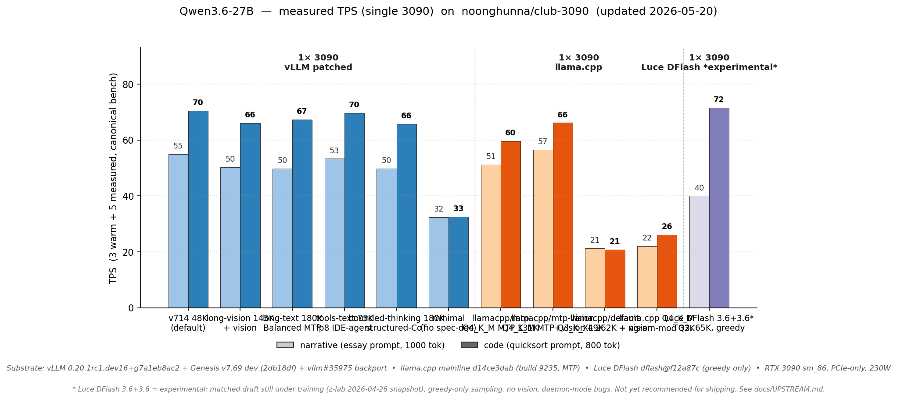

# Single 3090 — what fits, how to run it

You have **one RTX 3090 (24 GB VRAM)**. This page is the front door for picking a config and knowing what to expect. The model-specific deep dives (quants, Genesis patches, engine internals) live elsewhere — links at the bottom.

> **Model not in the configs below / want any HF safetensors repo?** → [`docs/PULL.md`](PULL.md): `scripts/pull.sh` evaluates any model against the KV math (honest, no download) and boots it if it passes. The curated configs on this page are the measured path; both work.

---

## ⚠️ Critical — read first if you're running an agentic coding client

If your workload is **hermes / openhands / OpenCode / Cline / Roo / OpenClaw / Aider / Cursor with retained context**, single-card vLLM is **not safe** as of 2026-05-03. You will hit a hardware-physical cliff at ~21-26K accumulated multi-turn context regardless of which single-card vLLM variant you pick. Validated across all six shipped single-card vLLM composes.

Symptoms users report: "performance degrades after ~20 turns", "throughput drops to 0", "engine becomes unresponsive then 500s", "OOM after 4-5 turns". Same root cause — see [#41](https://github.com/noonghunna/club-3090/issues/41) for the full validation matrix.

**Two safe paths for these workloads:**

| Have | Run | Why it works |
|---|---|---|
| 2× 3090 (any topology, NVLink optional) | `bash scripts/switch.sh vllm/dual` | TP=2 splits the failing kernel's working set across both cards. Validated PASS at v2 continuous soak; 111+ TPS p50 decode. |
| 1× 3090 only | `bash scripts/switch.sh llamacpp/default` | Different engine, different GDN kernel, different memory allocator. Cliff doesn't exist on this path. 200K context, ~51 / 60 TPS (Q4_K_M + MTP) — slower decode but cliff-immune. |

Neither acceptable? Two single-card vLLM mitigations: (a) cap session context at <15K via app-layer rolling summarization, OR (b) accept periodic engine restarts. **Mem-util tuning, MTP-off, and `max-num-batched-tokens` adjustments do not close it** — all tested. The cliff is in `chunk_gated_delta_rule_fwd`'s simultaneous live-tensor set (~500 MiB at T=4128) which doesn't fit alongside accumulated KV + model + workspace on a 24 GB card.

A Genesis sidecar fix (streaming refactor) is being filed with Sandermage. ETA 2-4 weeks if accepted. This section will be updated when it ships.

> ⚠️ **2026-05-05 update — Genesis v7.72.2's PN59 streaming-GDN doesn't close it.** Sander shipped PN59 advertising it as the structural Cliff 2b fix, but the eligibility check rejects calls with `chunk_indices`/`chunk_offsets` populated — which vLLM's mandatory `--max-num-batched-tokens 4128` always sets on 24 GB single-card configs. PN59 falls through to vanilla code which OOMs at the same site. Filed at [Sandermage/genesis-vllm-patches#22](https://github.com/Sandermage/genesis-vllm-patches/issues/22) with reproducer + 4 fix proposals; pending Sander review. **The two safe paths above remain the recommendation.**

For workloads that **don't** accumulate context across turns (single-shot RAG, simple chat, batch processing), single-card vLLM is fine — see the table below.

---

## TL;DR — pick by workload

> ⛔ **The four vLLM rows below are struck through — they're pinned to a purged vLLM nightly ([#167](https://github.com/noonghunna/club-3090/issues/167)) and won't boot until the next Genesis-compatible pin lands.** Until then, use the **llama.cpp / ik_llama** rows — they work today and are cliff-immune. (`minimal.yml` is Genesis-free and *can* still run on a current image via `VLLM_IMAGE=vllm/vllm-openai:latest`.)

> 💡 **Simplest vs fastest (single-card):** `llamacpp/default` (mainline Q4_K_M, clean upstream image) is the no-friction pick; **`ik-llama/iq4ks-mtp` is ~18–20% faster + leanest VRAM** (separate fork + IQK quant) for max single-card speed. Both are cliff-immune — see [#184](https://github.com/noonghunna/club-3090/discussions/184).
>
> 🎯 **Don't want to choose?** `bash scripts/switch.sh qwen3.6-27b/default` (or a bare `bash scripts/launch.sh`) resolves the **blessed single-card default automatically** — on one 3090 that's **`ik-llama/iq4ks-mtp` (fastest + leanest)**, with **`llamacpp/default` as the cliff-immune alternative** (this is the `single` order in `ENGINE_PREFERENCE`: `ik-llama > llama.cpp > vllm`; `beellama` ranks first but isn't onboarded yet — see [docs/UPSTREAM.md](UPSTREAM.md)). Pin your own with `--set-default <slug>`; see the [FAQ](FAQ.md#how-do-i-set-my-own-default-config).

| What you're doing | Compose | Max ctx | Narr / Code TPS | VRAM (24 GB / card) |
|---|---|---|---|---|
| ⛔ ~~**Long ctx + vision** (chat, agents, image input)~~ _(vLLM — blocked #167)_ | ~~[`long-vision.yml`](../models/qwen3.6-27b/vllm/compose/single/autoround-int4/long-vision.yml)~~ | ~~145K~~ | ~~50 / 66~~ | ~~23.0 GB~~ |
| ⛔ ~~**Long ctx, text-only — Balanced MTP** (RAG, codebase, IDE agents)~~ _(vLLM — blocked #167)_ | ~~[`long-text.yml`](../models/qwen3.6-27b/vllm/compose/single/autoround-int4/long-text.yml)~~ | ~~180K~~ | ~~50 / 67~~ | ~~22.3 GB~~ |
| ⛔ ~~**Long ctx, text-only — Max-context** (long single-shot RAG / codebase analysis)~~ _(vLLM — blocked #167)_ | ~~[`long-text-no-mtp.yml`](../models/qwen3.6-27b/vllm/compose/single/autoround-int4/long-text-no-mtp.yml)~~ | ~~200K~~ | ~~no MTP~~ | ~~21.0 GB~~ |
| ⛔ ~~**Bounded thinking** (coding agents, structured-CoT — see [STRUCTURED_COT.md](STRUCTURED_COT.md))~~ _(vLLM — blocked #167)_ | ~~[`bounded-thinking.yml`](../models/qwen3.6-27b/vllm/compose/single/autoround-int4/bounded-thinking.yml)~~ | ~~180K~~ | ~~50 / 66~~ | ~~21.7 GB~~ |
| **Bulletproof, no cliffs** (production service, unpredictable inputs) | [`llamacpp/default`](../models/qwen3.6-27b/llama-cpp/compose/single/unsloth-q4km/mtp.yml) (alias of `llamacpp/mtp`) | **200K** (via `-ub 512`) | 52 / 61 | ~23 GB |
| **llama.cpp + MTP, fast + long ctx** ⭐ (IDE agents, opencode, Hermes, long-multi-turn agentic; `CTX_SIZE=131072 UBATCH_SIZE=1024` for faster prefill) | [`llamacpp/mtp`](../models/qwen3.6-27b/llama-cpp/compose/single/unsloth-q4km/mtp.yml) | **200K** | **51 / 60** | ~22.5 GB |
| **llama.cpp + MTP + vision** (multimodal chat, screenshot-debugging, vision-aware review) | [`llamacpp/mtp-vision`](../models/qwen3.6-27b/llama-cpp/compose/single/unsloth-q4km/mtp-vision.yml) | **49K** | **57 / 66** | ~20.5 GB |
| **ik_llama + IQ4_KS + MTP** ⭐ (fastest single-card + leanest VRAM; advanced-quant track) | [`iq4ks-mtp`](../models/qwen3.6-27b/ik-llama/compose/single/ubergarm-iq4ks/mtp.yml) | **200K** | **~60 / ~69** | **~22 GB** (leanest) |
| **ik_llama + IQ4_KS + MTP + vision** | [`iq4ks-mtp-vision`](../models/qwen3.6-27b/ik-llama/compose/single/ubergarm-iq4ks/mtp-vision.yml) | **160K** | TBD | ~21 GB |
| **ik_llama + two-stage spec-dec** ⭐ (ngram+MTP, code-optimized) | [`iq4ks-two-stage`](../models/qwen3.6-27b/ik-llama/compose/single/ubergarm-iq4ks/two-stage.yml) | **200K** | **~59 / ~98** (code +35% vs MTP-only) | ~22 GB |
| **Small-context vLLM safe path** ([@stiggy2k16](https://github.com/noonghunna/club-3090/issues/43) data point) — IDE agents capped at <60K accumulated, when you need vLLM speed but llama.cpp is too slow. ⚠️ Genesis-free, but its default pin is purged (#167) — run it with `VLLM_IMAGE=vllm/vllm-openai:latest` until the pin's bumped | [`minimal.yml`](../models/qwen3.6-27b/vllm/compose/single/autoround-int4/minimal.yml) at `--gpu-memory-utilization 0.95 --max-model-len 65536` | **64K** | ~32 / ~33 (no MTP) | ~22.4 GB |

Run via `bash scripts/launch.sh` (interactive) or `bash scripts/switch.sh <variant>`.

> ## ⚠️ Two cliffs to know — both same root kernel, different triggers
>
> ### Cliff 2a — single-prompt OOM (mostly closed on v7.69) ✅
>
> **Pre-v7.69:** vLLM single-card variants crashed on single prompts >~50K tokens.
>
> **Post-v7.69 + vllm#35975 + 0.93 mem-util (Balanced MTP) or MTP-off + 0.95 (Max-context):** **60K single-prompt now passes cleanly** (verified HTTP 200, recall correct, AL=4.00 on Balanced MTP). 90K is past wall-clock-feasible on this hardware. For prompts >60K, use `dual-turbo.yml` (TP=2 splits state) or `llamacpp/default` (200K, different engine).
>
> The fix combines [vllm#35975](https://github.com/vllm-project/vllm/pull/35975) (skip `inputs_embeds` GPU buffer for text-only models, frees ~444 MiB at boot) with mem-util tuning to free activation headroom for the late-stage 50 MiB allocation that previously fired the cliff.
>
> ### Cliff 2b — accumulated-context OOM under multi-turn agent traffic (NOT closed) ❌
>
> Same kernel, different trigger. The 50 MiB `chunk_fwd_o → torch.empty_like(v)` allocation also fails when accumulated multi-turn KV cache + GDN forward live-tensor cascade peaks above 24 GiB on a single card. Hits at **~21-26K accumulated tokens** across 4-5 turns of hermes/openhands/OpenCode/Cline/OpenClaw — not just at 50-60K single prompts. Validated 2026-05-03 across all six shipped single-card vLLM composes; only `vllm/dual` (TP=2) and `llamacpp/default` survive. See the critical warning at the top of this page.
>
> Why this isn't tunable at the config layer: Codex investigation showed the simultaneous live-set of `chunk_gated_delta_rule_fwd` is ~500 MiB at T=4128 (q/k/v/u/v_new/o/w/A/Ai/h tensors all alive at once). Adding accumulated KV + model + workspace + MTP draft puts the per-card peak above 24 GiB. The fix has to be at the kernel level — streaming/pooling these intermediates rather than holding them simultaneously. That's an upstream PR target, not a config knob.

> ### What was Cliff 1 mech B (now closed) ✅
>
> Earlier in 2026-05 we tracked an inductor compile-path FFN intermediate buffer leak ([club-3090 #16](https://github.com/noonghunna/club-3090/issues/16)) that crashed long-* variants on real IDE-agent prompts. **Closed 2026-05-02** via Genesis PN25 (Inductor-safe `silu_and_mul` opaque op) + PN30 (DS conv state dst-shaped temp fix). Both fixes ship by default in our composes; ChatGPT/Codex CLI cross-check helped land the PN30 dst-shaped temp variant. No user action needed — a fresh `bash scripts/setup.sh qwen3.6-27b` picks up the fixes automatically.

---

## Measured TPS on single 3090



Bench protocol: 3 warm + 5 measured runs of the canonical narrative + code prompts on each config. Substrate: vLLM nightly `0.20.1rc1.dev16+g7a1eb8ac2` + Genesis v7.69 dev tip (commit `2db18df`), with local backports `patch_inputs_embeds_optional.py` (vllm#35975) and `patch_tolist_cudagraph.py`. llama.cpp mainline `0d0764dfd`, RTX 3090 sm_86 PCIe-only at 230 W. Per-config run-by-run + VRAM peaks: [models/qwen3.6-27b/CHANGELOG.md](../models/qwen3.6-27b/CHANGELOG.md).

---

## VRAM budget on 24 GB


What this says about single-card constraints:

- **Model weights** consume ~14 GB (AutoRound INT4 / GGUF Q3_K_XL). Half the card.
- **KV cache** is the next biggest line; its size depends on `--kv-cache-dtype` × ctx. fp8 ≈ 1 byte/token/(layer×head); TQ3 ≈ 0.4 bytes/token/(layer×head); fp16 ≈ 2 bytes/token/(layer×head).
- **Vision tower** (mmproj) costs ~0.5–1.0 GB extra when on.
- **Activations + cudagraph pools** is what's left. **2026-05-02 PM (v7.69 + vllm#35975 backport + Cliff 2 60K closed)** — settled at **180K + 0.93 (long-text Balanced MTP)**, **200K + 0.95 (long-text-no-mtp Max-context)**, **180K + 0.95 (bounded-thinking)**, and **145K + 0.95 (long-vision)** after v7.69 closed three v7.66/v7.68 regressions and the local #35975 backport freed ~444 MiB by skipping the text-only inputs_embeds GPU buffer. Both Cliff 1 mech B AND Cliff 2 60K are now CLOSED on TQ3 single-card. See [`docs/CLIFFS.md`](CLIFFS.md).

For the cross-card TP=2 picture, see [`DUAL_CARD.md`](DUAL_CARD.md).

---

## Pick a config

> ⛔ **The three vLLM configs immediately below — `long-vision`, `long-text`, `long-text-no-mtp` — are blocked on [#167](https://github.com/noonghunna/club-3090/issues/167)** and won't boot until the next Genesis-compatible pin lands. **Use the llama.cpp / ik_llama configs further down** (they work today and are cliff-immune); the vLLM entries are kept here for when the pin returns.

### ⛔ Long ctx + vision — `long-vision.yml` _(vLLM — blocked #167)_

**Workload:** chat with images, vision-aware coding agents, multimodal RAG. Anything where the user might paste a screenshot.

145K + vision tower + TQ3 KV + DS layout + Genesis MTP n=3 + full v7.69 patch stack (PN12 + PN17 + PN25 + PN30 part3 + PN26b + P38B + P15B + PN33 + PN32 GDN chunked-prefill) at mem-util 0.95. `verify-stress.sh`: full 7/7 probes pass on text-only paths post-v7.69; vision tower's persistent ~1 GB tightens single-prompt envelope vs long-text. Code 66 / narr 50 TPS (n=5, CV 2-4%), AL 3.40-3.56.

### ⛔ Long ctx, text-only — Balanced MTP — `long-text.yml` _(vLLM — blocked #167)_

**Workload:** RAG ingest, codebase analysis, book/document Q&A, IDE coding agents (Cline / OpenCode / Roo / Claude Code / Cursor), long conversations. _(Was the steady-state default; while #167 blocks it, use `llamacpp/default` below.)_

180K + no vision + TQ3 KV + DS layout + MTP K=3 + same v7.69 patch stack + local vllm#35975 backport at mem-util 0.93. **60K single-prompt PASS @ 623s wall** (HTTP 200, recall correct, AL=4.00). Code 67 / narr 50 TPS (n=5, CV 2.6%), AL 3.34-3.51. **IDE-agent prompts AND big single prompts up to 60K both work cleanly here.**

### ⛔ Long ctx, text-only — Max-context — `long-text-no-mtp.yml` _(vLLM — blocked #167)_

**Workload:** one-shot >50K input where you can wait, don't need MTP, and want maximum KV pool capacity.

200K + no vision + TQ3 KV + DS layout + MTP **off** + same v7.69 patch stack + local vllm#35975 backport at mem-util 0.95. **60K single-prompt PASS @ 537s wall** (HTTP 200, recall correct). Decode is slower without spec-decode (~33 narr / ~40 code TPS estimated; canonical bench pending). Use only when steady-state TPS isn't the priority and you need the extra KV headroom.

### Bulletproof / no cliffs — `llamacpp/default` ⭐

**Workload:** production service for unpredictable users. Inputs that might be 5K or might be 200K. Tool returns that might be 1K or might be 50K. Anywhere "predictable behavior" beats "peak TPS."

`bash scripts/switch.sh llamacpp/default` (alias of `llamacpp/mtp`, collapsed 2026-05-22). Q4_K_M MTP GGUF (`unsloth/Qwen3.6-27B-MTP-GGUF`) + q4_0 KV + MTP `n=2` at **200K** (max-safe — fills cleanly with ~1.1 GB margin; 262K *boots* but walls ~125K, see [`docs/CLIFFS.md`](CLIFFS.md)). No vision — use `llamacpp/mtp-vision` for multimodal. Different attention library entirely (ggml-cuda, not FA2) → no Cliff 1 mechanism, no Cliff 2 mechanism. **~52 / 61 TPS** — slower than vLLM dual but cliff-immune. Quant family validated by [Benjamin Marie's Kaitchup eval](https://kaitchup.substack.com/p/summary-of-qwen36-gguf-evals-updating).

### llama.cpp + MTP, fast + long ctx — `llamacpp/mtp` ⭐

**Workload:** IDE agents (opencode, Cline), Hermes, multi-turn agentic. The single-card sweet spot for "fast enough + plenty of context + bulletproof."

`bash scripts/switch.sh llamacpp/mtp`. Q4_K_M MTP-enabled GGUF (`unsloth/Qwen3.6-27B-MTP-GGUF`) + q4_0 KV + MTP `n=2` + `-ub 1024`. Mainline llama.cpp build 9235 (PR #22673 MTP merged). **~51 narr / ~60 code TPS** — ~2.5× faster than `llamacpp/default`, only marginally slower than vLLM single-card paths *and* without the cliffs. **Quality 102/150 (68%) on the 8-pack matrix beats every Qwen vLLM dual config in [#119](https://github.com/noonghunna/club-3090/discussions/119)**; **aider-polyglot 17/30 exactly matches Qwen vLLM bf16 dual on half the hardware**. **Verify-stress 7/7** including 60K + 91K needle recall — the Cliff 2 narrative is **config-driven, not architectural**: at this config the model walks past 91K cleanly on a single 3090. No vision (mmproj cost trades against KV pool); for multimodal, use `llamacpp/mtp-vision` below.

### llama.cpp + MTP + vision — `llamacpp/mtp-vision`

**Workload:** multimodal chat, screenshot-debugging, vision-aware code review, UI-screenshot agents. The first stack profile combining MTP + vision on a single 3090 (the older "strip mmproj when MTP" rule was obsolete on build 9235 — sweep-verified 2026-05-19).

`bash scripts/switch.sh llamacpp/mtp-vision`. Same Q4_K_M MTP GGUF + q4_0 KV + MTP `n=2` + `-ub 1024`, **with `--mmproj mmproj-F16.gguf` mounted**. Ctx 49K is the **speed-optimal** default (vision overhead trades against KV pool). **~57 narr / ~66 code TPS** (text path), vision overhead paid once at image-encode, not per decoded token. Verify-stress 7/7 at this config.

> **Need more context for agentic vision workloads?** Drop `-ub 1024 → 512` and you can push ctx to **192K** with full cliff coverage (verify-stress 7/7 incl. 91K needle), at the cost of ~10% TPS:
> ```bash
> UBATCH_SIZE=512 CTX_SIZE=196608 bash scripts/switch.sh llamacpp/mtp-vision
> ```
> Sweep data + reasoning in [`models/qwen3.6-27b/llama-cpp/README.md`](../models/qwen3.6-27b/llama-cpp/README.md#speed-vs-context--pick-your-trade-off). Surfaced 2026-05-20 by @JensJN in [#170](https://github.com/noonghunna/club-3090/discussions/170).

### ik_llama + IQ4_KS + MTP — `iq4ks-mtp.yml` ⭐

**Workload:** best quality-per-bit GGUF on a single 3090. Same cliff-immunity as llama.cpp (same ggml memory model), but with fork-exclusive IQK imatrix quants that beat mainline Q4_K_M on perplexity.

ubergarm `Qwen3.6-27B-MTP-IQ4_KS.gguf` (IQK imatrix quant, built-in MTP head) + q4_0 KV + `-khad`/`-vhad` (Hadamard K+V cache transforms) + MTP `n=2` + `--merge-qkv` + `--parallel-tool-calls` (ik-exclusive). **200K context** (max-safe default; native max 262K) on one 3090. At matched 370 W it's **~18–20% faster than `llamacpp/mtp`** on TPS (~60 narr / ~69 code vs ~50 / ~58), quality-tied (8-pack 103 vs 102), and **~0.5–0.8 GB leaner** — the faster *and* leaner single-card path. (A 2026-05-22 "tie" was a wrong-engine measurement artifact — corrected 2026-05-23 via a power-cap-controlled A/B, [#184](https://github.com/noonghunna/club-3090/discussions/184).) Engine: `ghcr.io/ikawrakow/ik-llama-cpp` (digest-pinned `cu13-server` build). See [`docs/engines/IK_LLAMA.md`](engines/IK_LLAMA.md) for the full deep dive.

### ik_llama + IQ4_KS + MTP + vision — `iq4ks-mtp-vision.yml`

Same as above with `--mmproj mmproj-F16.gguf` mounted for multimodal input. 160K context (vision tower trades against KV pool).

### ik_llama + two-stage spec-dec — `iq4ks-two-stage.yml` ⭐

**Workload:** code-heavy agentic workloads where context has repeated patterns (refactoring, test generation, boilerplate).

Chains ngram self-spec (catches repeated code spans, near-zero compute) with the MTP head as fallback for novel tokens. PR [#1789](https://github.com/ikawrakow/ik_llama.cpp/pull/1789) (merged 2026-05-15). **Tuned + measured on 1× 3090 (2026-05-24):** at the shipped defaults `ngram-mod n_max=4` + `MTP n_max=3`, decode is **~59 narr / ~98 code TPS** — narrative tied with `iq4ks-mtp` (~60), code **+35%** (97.8 vs 72.4 in a matched same-session A/B). ngram `n_max` was swept {2,3,4,5,8,16}: code decode is an inverted-U peaking at 4 (16→81.5, 8→90.4, **4→97.8**, 2→78.8) — too-long drafts waste verify compute, too-short ones stop matching code spans. The per-step recurrent checkpoint stays ~0.6 GB at n_max=4 (raising it OOMs → slow gpu-fallback re-decode; see the compose header). **Quality is lossless** (spec-dec): 8-pack 98/150 == MTP-only's 100/150, and aider-polyglot 16/30 == MTP-only's 19/30 — both within single-run noise; verify-full all green. **Ships 200K** (same as `iq4ks-mtp`): verify-stress fills to 183K with correct needle recall at every rung; the ceiling VRAM margin (~833 MB) is just under the 1024 MB sustained-agent-load guard, so for heavy agentic use right at the ceiling set `CTX_SIZE=180224` (~1.4 GB) or `163840` (~1.9 GB). **Use this for code; `iq4ks-mtp` for balanced/prose** — they're the two ⭐ single-card picks, same 200K ctx, two-stage ~0.8 GB leaner. See [`docs/engines/IK_LLAMA.md`](engines/IK_LLAMA.md) "Two-stage spec-dec" section.

---

## Other variants in the repo (not recommended for shipping)

These exist for troubleshooting, niche workloads, or historical comparison. Not promoted as primary because the long-* variants now cover their use cases:

- **`tq3-mtp.yml`** — 48K + TQ3 + vision, mem-util 0.92. The "below both cliffs by definition" baseline (engine HTTP-400-rejects requests >48K, so Cliff 2 is unreachable). Useful when you want bulletproof error behavior on a specific small-ctx workload, or as a fast-boot diagnostic. Most users should pick `long-vision` or `llamacpp/default` instead.
- **`tools-text.yml`** — 75K + FP8 KV + PN8. Was the only Cliff-1-safe single-card path before PN12 anchor fix landed. FP8 KV is closer in quality to FP16 than TQ3 is, so kept around for accuracy-sensitive comparisons. Most IDE-agent workloads now run fine on `long-text.yml`.
- **`minimal.yml`** — 32K + FP8 + no Genesis + no spec-decode. Stripped-down stack for isolating "is this a Genesis bug?" questions. Half the throughput of any other variant.

## Watch list — Luce DFlash + PFlash (not yet a recommendation)

Re-tested **2026-05-20** against [`Luce-Org/lucebox-hub`](https://github.com/Luce-Org/lucebox-hub) HEAD `248e191` on Qwen3.6-27B Q4_K_M target + the released [`Lucebox/Qwen3.6-27B-DFlash-GGUF`](https://huggingface.co/Lucebox/Qwen3.6-27B-DFlash-GGUF) draft. **The 3.6 draft has shipped and PFlash now exists in the binary — but Luce still loses to [`llamacpp/mtp`](../models/qwen3.6-27b/llama-cpp/compose/single/unsloth-q4km/mtp.yml) (v0.8.3) on every realistic workload except greedy-only code:**

Measured TPS on this rig (RTX 3090, single-stream, n_gen=1000):

| Workload | Luce DFlash @ temp=0.0 (greedy) | Luce DFlash @ temp=0.6 (realistic) | **llamacpp/mtp (any temp)** |
|---|---|---|---|
| Narrative essay | 37–47 TPS (mean ~40) | ~20 TPS (DDTree silent → AR-equivalent) | **51 TPS** ⭐ |
| Code (heap/LRU/AST) | 63–76 TPS (mean ~72) | ~20 TPS | **60 TPS** |
| AL (code) | 5.9–7.1 | n/a (DDTree off) | 3.4 (MTP) |

What works at HEAD 248e191:
- ✅ **Tool calls** via native Qwen3 path (no `server_tools.py` patch needed anymore).
- ✅ **Streaming SSE** with `reasoning_content` deltas.
- ✅ **Daemon mode** with cache-reuse for fast cold starts.
- ✅ **PFlash compresses at small source ctx** — verified 2026-05-20: 12K source → 1011 tokens kept (8.2%) → 3.3s response. PFlash drafter (Qwen3-0.6B BF16) loads cleanly when max-ctx ≤ 16K. No truncation when prompt format avoids tight-instruction phrasings.

What still keeps it off the recommended list (re-confirmed 2026-05-20):
- ❌ **Greedy only.** At temp > 0, DDTree silently disables and decode collapses to ~20 TPS (AR-equivalent). Kills chat / IDE-agent / creative-writing workloads. This is THE shipping gate.
- ❌ **Loses to llamacpp/mtp at realistic temperatures.** 20 t/s vs 51–60 t/s — AND llamacpp/mtp ships clean via `ghcr.io/ggml-org/llama.cpp:server-cuda` (no source build, no Python+CUDA toolchain).
- ❌ **PFlash on single 3090 is structurally constrained via the C++ HTTP server.** Drafter (1.43 GB) + target + KV + DDTree workspace = OOM at max-ctx ≥ 32K. Working ceiling is max-ctx=16K → caps source prompts at 16K, far below the headline 128K claim. Luce's published 128K bench is via different binaries (Python `server.py` or `test_dflash`), not the production HTTP server we'd ship. Dual GPU may unlock the C++ HTTP path at long source ctx — untested.
- ❌ **Verify-stress prompt format triggers premature EOS at long-ctx + greedy.** "Reply with only the phrase, no other text" returns one word; rephrased prompts recall correctly. Same shape as Luce upstream [#121](https://github.com/Luce-Org/lucebox-hub/issues/121) (closed via PR #128, which IS in our build) but extends to the non-PFlash + FP16-KV path. Not a script bug; a Luce + greedy + tight-instruction interaction.
- ❌ **No vision** tower.
- ❌ **`enable_thinking` chat_template_kwargs handled differently** than vLLM — verify-full check 6 fails.
- ❌ **Daemon-mode hang at long source ctx.** Observed 2026-05-20: the first ≥50K request can lock the GPU for minutes, blocking subsequent requests; cleared by server restart.
- ❌ **Build fragility** — fresh `git clone` of `dflash` requires `git submodule update --init`, plus `-DCMAKE_CUDA_ARCHITECTURES=86 -DDFLASH27B_ENABLE_BSA=ON`. No upstream docker image.

**Re-test triggers (any one would change the verdict):**
- Luce upstream adds non-greedy sampling support to DDTree (single biggest unblock — opens chat/IDE workloads)
- Luce-Org publishes an official docker image (removes build/toolchain burden, satisfies the club-3090 "image pulls and runs" substrate)
- Luce's C++ HTTP server validates source length **after** PFlash compression (would let single 3090 reach the 128K source claim through the production server)
- We add a dual-GPU compose target and confirm PFlash drafter fits

Track in [`docs/UPSTREAM.md`](UPSTREAM.md#luce-dflash-luce-orglucebox-hub).

---

## What single-card can't do

| Want | Why not on 1× | What you'd need |
|---|---|---|
| 4 concurrent streams at 262K + vision | KV pool too small for 4 × full ctx | TP=2 (see DUAL_CARD.md) |
| Peak code TPS (>100 TPS on quicksort prompt) | DFlash N=5 needs head_size=256 + non-causal — vLLM head-dim split | TP=2 + DFlash |
| Single-prompt >60K tokens on vLLM | Cliff 2 (DeltaNet GDN forward), no fix yet | TP=2 OR llama.cpp 200K (different engine) |

---

## Common pitfalls (single-card specifics)

### Prefill cliffs

- **Cliff 1** — FFN intermediate-buffer activation peak (138 MiB allocate at `intermediate_size × max-num-batched-tokens`). Historically fired on long-ctx composes at >0.95 mem-util when prefill batch needed the buffer. **Closed on `tools-text.yml`** (FP8 KV path) since 2026-04-29 via Genesis PN8. **Closed on TQ3 paths** on v0.20 + Genesis v7.65+ since 2026-05-01 via PN12 + PN17 + P38B in-source hooks. **Mech B closed** 2026-05-02 (v7.66 + PN25 v3 + PN30 dst-shaped) — see [`docs/CLIFFS.md`](CLIFFS.md).
- **Cliff 2** — DeltaNet GDN forward OOM. **Closed at 60K single-prompt** as of 2026-05-02 PM via Genesis v7.69 (PN32 GDN chunked-prefill + P103 worker self-install) plus a local backport of vllm#35975 (skip text-only `inputs_embeds` GPU buffer, ~444 MiB freed). Two shippable variants: `long-text.yml` (Balanced MTP, 180K + 0.93) and `long-text-no-mtp.yml` (Max-context, 200K + 0.95). >60K still hits the 24 GB hardware-physical wall — for those prompts use dual-card TP=2 (verified 237K) or llama.cpp single-card (200K, different engine).

### VRAM peak vs idle

`nvidia-smi` at boot ≠ peak. Boot shows weights + KV pool reservation. **Peak adds activation buffers during prefill** — typically +500-1500 MiB. If `nvidia-smi` shows 23.5/24 GB at idle, you have ~500 MiB for prefill activations — not enough for the 138 MiB-class buffer at long ctx. Drop mem-util by 0.03 if you need the headroom.

### Tool-call extraction needs `--enable-auto-tool-choice`

vLLM ships this off by default. Our composes set `--tool-call-parser qwen3_coder` + `--enable-auto-tool-choice`. If you're rolling your own compose, both are required.

### Running alongside a desktop / sub-24 GB usable VRAM

The compose defaults are calibrated for **headless** 3090 (no display server, no other GPU consumers). If you're running on a workstation where the same GPU also drives a desktop session — or your card has slightly less effective VRAM (e.g., some 4090s land at ~23.5 GB usable with X server overhead) — the default `max-model-len` may exceed your KV-cache budget at default `gpu-memory-utilization`.

Two env-override knobs available on every vLLM compose (defaults preserved if unset):

```bash
MAX_MODEL_LEN=32768 \
GPU_MEMORY_UTILIZATION=0.80 \
  bash scripts/switch.sh vllm/minimal
```

- `MAX_MODEL_LEN` — shrink the KV-cache budget; trades long-context for fit. `90000` is a safe value for `long-text.yml` on rigs with ~1 GB of overhead (4090 with display, etc.). Validated on @laurimyllari's 4090 ([disc #62](../../../noonghunna/club-3090/discussions/62)).
- `GPU_MEMORY_UTILIZATION` — reserve a percentage of VRAM for non-vLLM GPU consumers. **Stay in `0.85-0.92` range** for TQ3 KV paths on 24 GB Ampere. `0.80` is generally too aggressive — vLLM's profiling phase eats more than the saved 0.05 budget and reports `No available memory for the cache blocks` at engine init. fp8 KV paths (`tools-text.yml`, `dual.yml`) tolerate `0.80` better.

Generally prefer **dropping `MAX_MODEL_LEN` first** (clean KV budget reduction, predictable behavior) over `GPU_MEMORY_UTILIZATION` (interacts with profiling overhead in non-obvious ways). Drop both if your envelope is really tight.

### Running two llama.cpp / ik variants at once

Each variant ships a **distinct default `container_name`** (`llamacpp/mtp` → `llama-cpp-qwen36-27b`, `llamacpp/mtp-vision` → `llama-cpp-qwen36-27b-vision`; ik's `iq4ks-mtp` / `-vision` / `-two-stage` likewise), so they no longer collide on the docker name. They **do** still share the default host port `8020`, so give the second one a port with `ESTATE_PORT` (and, if you want a custom name, `ESTATE_CONTAINER`):

```bash
# text workhorse on :8020 + vision variant on :8030, side by side
bash scripts/switch.sh llamacpp/mtp
ESTATE_PORT=8030 bash scripts/switch.sh llamacpp/mtp-vision
```

(Whether both fit depends on your VRAM envelope — two full-context single-card servers won't co-reside on one 24 GB card; drop `CTX_SIZE` on one, or use this across two cards.)

---

## Quick start

```bash
# 1. Setup (downloads model, clones Genesis, ~20 min cold)
bash scripts/setup.sh qwen3.6-27b

# 2. Pick + boot via wizard (asks model + GPUs, projects VRAM budget)
bash scripts/launch.sh

# 3. Or skip the wizard:
bash scripts/launch.sh --variant beellama/dflash   # single-card default (DFlash, code-fast)
bash scripts/launch.sh --variant llamacpp/default  # easy mode

# 4. Sanity test
curl -sf http://localhost:8020/v1/chat/completions \
  -H "Content-Type: application/json" \
  -d '{"model":"qwen3.6-27b-autoround","messages":[{"role":"user","content":"Capital of France?"}],"max_tokens":200}'

# 5. Switch later without re-running setup
bash scripts/switch.sh vllm/long-vision    # for example
bash scripts/switch.sh --list              # show all variants
```

---

## Models supported on single 3090

- **[Qwen3.6-27B](../models/qwen3.6-27b/)** — primary model. Quant choices, Genesis patches, engine internals all in the model directory.
- More models coming. As they're added, this section will list which single-card configs each one supports.

---

## Deep dives

- **[Model README](../models/qwen3.6-27b/)** — quant choices (AutoRound INT4 / GGUF Q3_K_XL), Genesis patch surface, what's working / what's not.
- **[INTERNALS.md](../models/qwen3.6-27b/INTERNALS.md)** — engineering rationale (Genesis P65/P66/PN8, Marlin pad fork, MTP, the cascade bug, upstream tracker).
- **[VRAM allocation diagram](../models/qwen3.6-27b/README.md#vram-allocation-across-configs)** — full per-config breakdown across single + dual.
- **[FAQ.md](FAQ.md)** — common questions (4090 / 5090 support, why MTP not EAGLE, Copilot Gateway, what's a cliff, etc.).
- **[EXAMPLES.md](EXAMPLES.md)** — Python / TS / curl client snippets + IDE connection settings.
- **[HARDWARE.md](HARDWARE.md)** — Ampere SM 8.6 specifics, NVLink (declined), power caps.
- **[DUAL_CARD.md](DUAL_CARD.md)** — when you need what single-card can't deliver.
